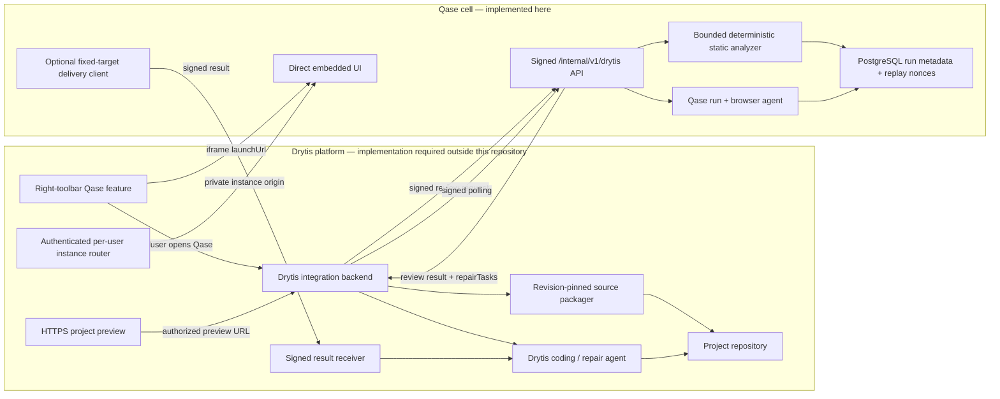

# Drytis ↔ Qase integration contract

Status: Qase-side implementation contract, schema `2026-08-1`

Audience: Drytis toolbar, project-runtime, project-packaging, coding-agent, and platform teams

This document describes the integration that exists in this Qase repository. It is deliberately explicit about the boundary: Qase can accept a signed, bounded project snapshot and an HTTPS preview, run deterministic white-box analysis plus the existing browser agent, and return findings and repair tasks. This repository does **not** contain the Drytis application, toolbar, per-user instance orchestrator, project repository, webhook receiver, or code-fixing agent. Those Drytis-side pieces still have to be implemented against this contract.

The machine-readable API contract is [`drytis-integration.openapi.yaml`](./drytis-integration.openapi.yaml).

## 1. System boundary



There are three independent trust boundaries:

1. **Service data plane:** Drytis backend requests are authenticated with an exact-raw-request HMAC. This is never a browser credential.
2. **Instance routing:** Drytis authenticates the human and routes them to an isolated Qase instance whose trusted environment supplies organization, project, and user identity.
3. **Embedding policy:** one exact HTTPS Drytis origin may be permitted by CSP `frame-ancestors`; otherwise Qase cannot be framed.

Do not place the service HMAC secret in the browser or treat the direct launch URL as an authorization credential.

## 2. End-to-end lifecycle

```mermaid
sequenceDiagram
    autonumber
    actor User
    participant UI as Drytis toolbar
    participant DBE as Drytis backend
    participant Repo as Drytis project store
    participant QAPI as Qase signed API
    participant QA as Qase analyzers / browser agent
    participant Router as Drytis instance router
    participant Fix as Drytis repair agent

    User->>UI: Open Qase for a project revision
    UI->>DBE: Start review for project + revision
    DBE->>Repo: Build secret-free, revision-pinned manifest
    DBE->>QAPI: POST /reviews (signed raw bytes)
    QAPI->>QAPI: Verify signature, timestamp, nonce, cell, idempotency
    QAPI->>QA: Analyze source in memory
    QAPI->>QA: Start black-box run when requested
    QAPI-->>DBE: 201 ReviewResult + launchUrl
    DBE-->>UI: Persist mapping and return launchUrl
    UI->>Router: Request assigned Qase instance
    Router-->>UI: Private instance origin
    UI->>QAPI: Load launchUrl in allowed iframe
    QAPI-->>UI: Landing page; Begin transmission opens /?run={reviewId}
    loop Until terminal status
        DBE->>QAPI: GET /reviews/{id} (new nonce, signed empty body)
        QAPI-->>DBE: Combined white-box + black-box result
    end
    DBE->>Fix: Supply repairTasks as untrusted evidence
    Fix->>Repo: Propose minimal changes + regression tests
    Repo-->>DBE: New immutable revision
    Note over DBE,QAPI: Create a new review UUID for the new revision
```

`POST /reviews` performs white-box analysis synchronously. If black-box testing is requested, it starts the browser-agent turn before returning, but the turn itself continues asynchronously. Polling is the canonical way to observe completion.

## 3. Data exchanged

### Drytis → Qase

| Data | Purpose | Constraints / retention |
|---|---|---|
| `externalReviewId` | Drytis-owned review correlation key | Lower-case canonical UUID. It is also the Qase run ID in this implementation. Reuse it only for a byte-identical idempotent create retry. |
| `project.id`, `name`, `revision` | Bind the review to a project/revision | `project.id` must exactly equal the Qase cell's trusted project ID. Name/revision are untrusted labels. |
| `projectContext` | Help choose representative coverage | Optional bounded product labels: description, application type, primary language, frameworks, environment, and default branch. Never commands or credentials. |
| `containerUrl` | Canonical black-box browser target | HTTPS only; no URL credentials, query string, or fragment; required exactly when `blackBox` is true. `previewUrl` remains a deprecated alias. |
| `requestedChecks` | Select black-box and/or white-box review | Both booleans are required and at least one must be true. |
| `sourceSnapshot` | White-box input | Required exactly when `whiteBox` is true. Validated UTF-8 text only. Analyzed in memory; submitted file contents and source-line snippets are not persisted by the integration. Structural paths/line numbers, hashes, rule metadata, and repair prompts are persisted. |
| Signing headers | Authenticate and correlate the request | Timestamp, one-time nonce, business idempotency key, correlation ID, and HMAC signature are required on **every** endpoint, including GET. |
| Empty `{}` body | Explicit start, stop, or delivery request | No additional fields are accepted. A caller cannot select a callback URL. |

### Qase → Drytis

| Data | Purpose | Notes |
|---|---|---|
| Review identity and `launchUrl` | Correlate a Drytis review to Qase and open it | `qaseRunId` currently equals `externalReviewId`. |
| Status | Drive toolbar state | `ready`, `running`, `stopping`, `awaiting_input`, `completed`, `failed`, or `interrupted`. |
| White-box analysis | Static findings, structural locations, coverage description, hashes, and limitations | Does not contain source files, source-line snippets, repair-prompt duplicates, or the per-file inventory/coverage retained only during analysis. Revision-bound prompts are returned once in top-level `repairTasks`. |
| Black-box result | Sanitized browser findings and final report | Finding URLs have query strings and fragments removed. Text is bounded and passed through Qase error/detail sanitization. At most 40 severity-prioritized findings are returned per check track. |
| Severity summary | Counts across both check types | `critical`, `high`, `medium`, `low`, and `info`. |
| `repairTasks` | Narrow repair instructions for Drytis's coding agent | Prompts are generated from untrusted project/test evidence. Treat them as data, re-authorize every change, and verify against the pinned revision. |
| `findingsPage` / `repairTasksPage` | Make bounded responses explicit | `total`, `returned`, and `truncated` prevent a bounded response from being mistaken for the full Qase finding set. The Qase UI remains the source for findings omitted from the integration response. |
| Delivery status | Result of optional fixed-target push | Upstream response bodies are not persisted. Polling remains authoritative. |
| Correlation response header | Trace a call | Successful responses include `X-Correlation-Id` copied from the verified request. |

Qase does not return the source snapshot, user credentials, browser session cookies, chat transcript, or arbitrary upstream callback responses through this contract.

## 4. Service authentication and signing

### Required Drytis request headers

Every request under `/internal/v1/drytis`, including `GET /capabilities` and result polling, must carry:

| Header | Format |
|---|---|
| `X-Drytis-Timestamp` | Unix seconds, 10–11 decimal digits. Default accepted skew is ±300 seconds. |
| `X-Drytis-Nonce` | Unique per signed attempt; 16–128 characters. |
| `Idempotency-Key` | Stable per business operation; 8–200 characters. Still required for signed GET requests even though GET does not persist business idempotency. |
| `X-Correlation-Id` | Trace identifier; 8–128 characters. |
| `X-Drytis-Signature` | `v1=` followed by 64 lower-case hexadecimal HMAC characters. |

Nonce, idempotency key, and correlation ID use the token alphabet `[A-Za-z0-9._~:/-]`, with an alphanumeric first character.

### Canonical form

Compute SHA-256 over the exact HTTP body bytes. For GET, the body is zero bytes. Join these fields with a single LF (`\n`) and no trailing newline:

```text
qase-drytis-hmac-v1
drytis
{X-Drytis-Timestamp}
{X-Drytis-Nonce}
{Idempotency-Key}
{X-Correlation-Id}
{UPPERCASE_HTTP_METHOD}
{EXACT_REQUEST_TARGET}
{LOWERCASE_HEX_SHA256_OF_BODY}
```

`EXACT_REQUEST_TARGET` is the path plus query string as sent on the wire, beginning with `/`; it does not include scheme or host. Query ordering and raw JSON formatting therefore matter. Compute `HMAC-SHA256(canonical, shared_32_byte_key)` and send its lower-case hexadecimal digest as `X-Drytis-Signature: v1={digest}`.

The shared key is the unpadded base64url encoding of exactly 32 random bytes in `QASE_DRYTIS_HMAC_KEY`. Keep it in both platforms' secret managers. Never place it in browser code, logs, source manifests, or Git.

### Retry semantics

Transport replay protection and business idempotency are separate:

- Every network attempt needs a **fresh nonce**, even when retrying.
- Retrying a create/start/stop/deliver operation uses the **same idempotency key and exact same raw body bytes**.
- Reusing an operation's idempotency key with different body bytes returns `409 idempotency_conflict`.
- Creating the same review UUID with another idempotency key returns `409 review_exists`.
- A replay of a completed or failed operation returns `200` and `Idempotent-Replay: true` instead of executing again.
- An explicit start, stop, or delivery request is recorded as `pending` before its side effect. A byte-identical retry with the same key resumes a still-pending operation after an interrupted request/process; once its record is `completed` or `failed`, the same key only observes the stored result. Use a new business key only for an intentional new attempt after a recorded failure.

Production nonce consumption is atomic and tenant-scoped in PostgreSQL. The in-memory nonce store is allowed only for local/single-node development; production startup rejects integration mode without the PostgreSQL run store.

### Qase result push signing

When fixed-target delivery is configured, Qase signs its outbound POST with the same canonical form except line 2 is `qase`, and the headers are:

- `X-Qase-Timestamp`
- `X-Qase-Nonce`
- `Idempotency-Key`
- `X-Correlation-Id`
- `X-Qase-Signature`

Drytis must implement the reciprocal raw-byte verification, timestamp window, atomic nonce consumption, and business idempotency. The target is server configuration, never request data. Redirects are rejected. Only an exact allowlisted HTTPS origin is accepted.

The current client accepts any 2xx response. A `204` may have no body; any other 2xx must return bounded JSON with an appropriate JSON content type. Qase records the status code but deliberately discards the response body.

## 5. HTTP API

Base path: `/internal/v1/drytis`

Schema version: `2026-08-1`

Media type for POST bodies: `application/json`

All response bodies are JSON except that no Qase integration endpoint intentionally returns 204. Responses carry `Cache-Control: no-store`. Authentication happens before route selection, so even an unknown path must be signed.

### `GET /capabilities`

Returns supported check modes, snapshot schemas and limits, retention behavior, polling/push availability, enabled `start`/`stop`/`deliver` controls, and the launch path template. The exact request target, including any query string, must be signed. A query is not otherwise interpreted.

### `POST /reviews`

Creates one integration-backed QA run. White-box analysis happens in memory before persistence. Black-box testing auto-starts when requested.

```json
{
  "schemaVersion": "2026-08-1",
  "externalReviewId": "8768e292-6278-4daa-a61a-56ab81e081fc",
  "project": {
    "id": "f2964599-fb3a-4c4e-acec-ee84d74fab55",
    "name": "Vice Shores",
    "revision": "git:abc123"
  },
  "projectContext": {
    "applicationType": "B2B SaaS",
    "primaryLanguage": "TypeScript",
    "frameworks": ["React", "Node.js"],
    "environment": "ephemeral-preview",
    "defaultBranch": "main"
  },
  "containerUrl": "https://preview.example.drytis.app/",
  "requestedChecks": {
    "blackBox": true,
    "whiteBox": true
  },
  "sourceSnapshot": {
    "schemaVersion": "2026-08-1",
    "project": {
      "id": "f2964599-fb3a-4c4e-acec-ee84d74fab55",
      "name": "Vice Shores",
      "revision": "git:abc123"
    },
    "files": [
      {
        "path": "src/checkout.ts",
        "content": "export function checkout() { return true; }\n",
        "sha256": "da2841f6e318a7d2dca368d5372efcc5dfb03bc7dc4bbef8f7d371707a5d14d2",
        "sizeBytes": 44
      }
    ]
  }
}
```

Important invariants:

- Objects reject unknown fields.
- The top-level `project` and `sourceSnapshot.project` must match exactly after normalization.
- `project.id` must match the trusted project bound to the Qase cell.
- `containerUrl` or its deprecated `previewUrl` alias is required if and only if black-box testing is requested. If both are present, they must normalize identically.
- `sourceSnapshot` is required if and only if white-box testing is requested.
- The request must ask for at least one check.
- `externalReviewId` becomes the Qase run ID. Drytis should generate a new UUID for each logically new revision assessment.

Response:

- `201`: newly created review (black-box may already show `running`, `completed`, or `failed`, depending on startup timing).
- `200` plus `Idempotent-Replay: true`: proven byte-identical replay.
- See the OpenAPI document for the complete `ReviewResult` schema.

### `GET /reviews/{reviewId}`

Returns the current combined result. It does not return chat messages, credentials, source files, or arbitrary runtime state. Use a new nonce for every poll. Suggested polling should use exponential backoff with jitter and stop on `completed`, `failed`, or `interrupted`; `awaiting_input` should be surfaced to a human rather than treated as success.

### `POST /reviews/{reviewId}/start`

Body must be exactly `{}`. Starts another black-box attempt if black-box testing was authorized. It returns `202` for a new request and `200` with `Idempotent-Replay: true` for the same persisted request. If work is already running, it does not start a duplicate turn.

This operation is not a white-box rerun. Send a new `POST /reviews` with a new review UUID for a changed source revision.

### `POST /reviews/{reviewId}/stop`

Body must be exactly `{}`. The review must currently be `running`, `starting`, `queued`, `awaiting_input`, or `stopping`; otherwise Qase returns `409 review_not_active` without recording a new stop. For an active review, Qase persists the stop request, asks the existing agent service to stop the run, marks the run `interrupted`, and returns `202`. A proven replay returns `200` with `Idempotent-Replay: true` and does not repeat the stop call. A short-lived concurrent poll can observe `stopping`; the durable post-stop result is `interrupted`.

### `POST /reviews/{reviewId}/deliver`

Body must be exactly `{}`. This endpoint exists only when `QASE_DRYTIS_RESULTS_PATH` configured a fixed delivery target; otherwise it returns `409 delivery_not_configured`.

Delivery is synchronous in the current adapter:

1. Qase persists `delivery.status = delivering`.
2. Qase posts the current `ReviewResult` to the fixed target using `X-Qase-*` signing headers.
3. On a 2xx receipt, Qase persists `delivered` and the upstream status, then returns the updated result.
4. On rejection/network failure, Qase persists a sanitized `failed` state and returns a `502` error.

The pushed payload can therefore contain `delivery.status = delivering`; poll Qase after the call for the durable `delivered`/`failed` state. There is no background outbox retry in this version.

## 6. Review result interpretation

The result combines independent check tracks:

```text
ReviewResult
├── identity: schemaVersion, externalReviewId, qaseRunId, project, launchUrl
├── status: combined lifecycle status
├── checks
│   ├── whiteBox: requested, status, compact analysis + findingsPage
│   └── blackBox: requested, status, attempts, containerUrl, deprecated previewUrl alias, findings + findingsPage, report
├── summary: total/returned findings, truncation flag, five severity counts, best available verdict
├── repairTasks + repairTasksPage: bounded white_box and black_box repair instructions
├── delivery: optional fixed-target delivery state
└── createdAt / updatedAt
```

White-box verdicts are `issues_found`, `review_recommended`, `no_deterministic_findings`, or `insufficient_static_coverage`. The last value means the snapshot passed integrity/secret screening but none of its files had language-specific rules; it is never a pass. Black-box report verdicts are `pass`, `pass_with_issues`, `fail`, or `blocked`. The combined summary uses the black-box report verdict when a report exists; otherwise it uses the white-box verdict. A `blocked` report is not a pass and should be triaged by a human. Overall completion supports white-box-only, black-box-only, and combined reviews; `stopping` is an in-flight control state and `interrupted` is terminal.

### Repair-task safety

Both source paths and browser evidence can contain prompt-injection text. The generated prompts explicitly label embedded evidence as untrusted, but that is not a complete security boundary. Before a Drytis code agent acts:

1. Bind the task to the exact organization, project, and immutable revision from the review.
2. Parse the structured fields; never concatenate them into a higher-privilege system instruction.
3. Apply repository permission checks and branch protections independently.
4. Propose a narrow patch, add a regression test, and run the project's own checks in an isolated environment.
5. Require human approval according to Drytis policy for high-risk files, dependencies, infrastructure, auth, billing, or destructive changes.
6. Create a new revision and a new Qase review; never mark an old result as proof for changed code.

Qase returns repair suggestions. It does **not** apply code changes to Drytis.

## 7. White-box snapshot and analyzer

### Manifest contract

```text
sourceSnapshot
├── schemaVersion: "2026-08-1"
├── project: { id, name, revision }
└── files: non-empty array
    └── { path, content, sha256, sizeBytes? }
```

`sha256` is 64 hexadecimal characters, optionally prefixed by `sha256:`. `sizeBytes`, when supplied, must equal the UTF-8 byte length. Paths must be unique case-insensitively after NFC normalization.

### Hard limits

| Limit | Value |
|---|---:|
| Files | 1,000 |
| Per-file UTF-8 bytes | 524,288 |
| Total source UTF-8 bytes | 12,582,912 |
| Path UTF-8 bytes | 512 |
| Project ID/name/revision characters | 200 each |
| Retained findings | 200 |
| Compact analysis persisted by integration | 750,000 bytes |
| Initial integration state plus mapped findings | 900,000 bytes |
| Returned white-box findings | 40, severity prioritized |
| Returned black-box findings | 40, severity prioritized |
| Returned repair tasks | 80 total |
| Serialized `ReviewResult` | less than or equal to 900,000 bytes |
| Default/max signed HTTP request | 16,777,216 bytes |

The HTTP parser's hard ceiling is 16 MiB. Lowering `QASE_DRYTIS_MAX_REQUEST_BYTES` applies an additional verifier limit.

### Accepted and rejected content

Accepted files are text with one of these extensions:

```text
.bash .cfg .cjs .conf .cs .css .cts .dart .fs .fsx .go .gql .graphql
.htm .html .ini .java .js .json .jsonc .jsx .kt .kts .less .md .mdx
.mjs .mts .php .properties .ps1 .psm1 .py .pyi .rb .rs .sass .scala
.scss .sh .sql .svelte .swift .toml .ts .tsx .txt .vue .xml .yaml
.yml .zsh
```

The following extensionless/special basenames are also accepted: `Containerfile`, `Dockerfile`, `Gemfile`, `Jenkinsfile`, `Makefile`, `Pipfile`, `Procfile`, `Rakefile`, `go.mod`, `go.sum`, and `yarn.lock` (case-insensitive).

The validator rejects:

- absolute, Windows, percent-containing, non-normalized, traversal, control-character, or otherwise unsafe paths;
- duplicate/case-colliding paths;
- binary/invalid Unicode or unsupported file types;
- incorrect byte counts or SHA-256 digests;
- `.env`, `.env.*`, `.npmrc`, `.pypirc`, `.netrc`, common private-key names, and certificate/key-store extensions;
- recognized private keys, provider tokens, authorization credentials, credentialed URLs, and likely literal secret assignments.

The Drytis packager should exclude dependencies, build output, generated/minified bundles, media, archives, caches, VCS data, and all secrets before submission. Placeholder/environment references are preferable to secret-like literals.

### What analysis does and does not do

The analyzer never installs dependencies, imports modules, compiles, executes project code, opens source files from disk, or writes submitted source to disk. It performs deterministic pattern checks over JavaScript/TypeScript, Python, structured configuration/package metadata, and container files. Current rule families include dynamic execution and shell construction, unsafe TLS/HTML/deserialization/SQL patterns, async/error-handling risks, unsafe configuration/CORS/debug/workflow settings, dependency pinning/pipe-to-shell, and container image/user concerns. Other allowlisted languages receive path, digest, text/binary, and secret screening only; `filesAnalyzed` counts only files with substantive language-specific rules and `filesWithoutLanguageRules` exposes the gap.

Persisted output includes aggregate inventory/coverage, structural evidence paths and line numbers, rule metadata, hashes, limitations, and repair prompts. It deliberately removes submitted file contents, source-line snippets, full file inventories, and per-file coverage before persistence. Drytis-facing white-box analysis omits the prompt duplicate; the same bounded, revision-bound instruction is exposed once through `repairTasks`.

Static analysis is not proof of exploitability, correctness, or absence of defects. It does not provide data-flow analysis, dependency CVE resolution, compilation/type checking, runtime behavior, infrastructure verification, or generated-code analysis.

## 8. Direct launch and toolbar embedding

The toolbar receives `launchUrl` from the Drytis backend and must never construct
it from user input. It points directly at the assigned instance and run:

```text
https://{per-user-qase-origin}/?run={externalReviewId}
```

Launch flow:

1. Drytis authenticates the user before resolving a Qase instance.
2. The Drytis instance router returns only the private instance assigned to that user and project.
3. The toolbar validates the configured origin and loads the returned `launchUrl`.
4. Qase shows its landing page. **Begin transmission** opens the workspace directly; there is no Qase login, owner password, session cookie, or sign-out action.
5. The workspace validates the UUID, selects the matching visible run, and removes the query parameter from browser history.

The Qase HTTP API trusts this per-user instance boundary. It is not suitable for
direct anonymous Internet exposure. The Drytis gateway must prevent users from
reaching another user's instance, and trusted bootstrap environment values must
bind the instance to the expected organization, project, and actor. Qase still
rejects cross-origin API requests.

Set `QASE_DRYTIS_EMBED_ORIGIN` to one exact HTTPS Drytis origin to allow
embedding. Qase emits that origin in CSP `frame-ancestors` and omits the
incompatible `X-Frame-Options: DENY`. When unset, CSP remains
`frame-ancestors 'none'` and `X-Frame-Options: DENY`. Wildcards, paths,
credentials, query strings, fragments, and HTTP origins are rejected.

Restrict the iframe permissions to the minimum the Qase UI needs; Qase already
denies camera, microphone, and geolocation.

## 9. Drytis-side implementation checklist

This work is outside the present repository and is required for a real integration:

### Backend adapter

1. Provision a Qase cell mapping for each Drytis organization/project and keep its project UUID immutable.
2. Keep the HMAC key in a server secret manager. Implement exact raw-byte signing before the HTTP client mutates/re-serializes the body.
3. Generate and persist a lower-case canonical `externalReviewId`, revision, Qase base URL, idempotency keys, and correlation IDs.
4. Build the source manifest from an immutable revision, apply the source allowlist/secret exclusions, and compute SHA-256 over exact UTF-8 content.
5. Resolve an authorized HTTPS preview for that same revision. Do not send user-controlled callback URLs.
6. Call `POST /reviews`, persist the returned mapping/status/launch URL, and expose it to the toolbar.
7. Poll `GET /reviews/{id}` with bounded exponential backoff and fresh signed nonces. Make polling resume after Drytis process restarts.
8. Optionally expose an operator action that calls `/deliver`, or implement a signed fixed-target receiver. Polling is still the source of truth.

### Toolbar

1. Add Qase as a project-scoped right-toolbar item.
2. Ask the backend to create or retrieve the review for the selected revision; never call the signed Qase API from browser JavaScript.
3. Show explicit states for packaging, analyzing, running, stopping, awaiting input, failed, interrupted, and completed.
4. Load only the returned `launchUrl` in the Qase panel after validating its configured Qase origin.
5. Route Start, Stop, and optional Deliver controls through the Drytis backend so the HMAC secret never reaches the browser.
6. Provide retry controls that create intentional new idempotency keys; create a new review ID after the revision changes.

### Instance routing

1. Authenticate the Drytis user before resolving an instance.
2. Provision or resume exactly one isolated Qase instance for the authorized user/project binding.
3. Inject only trusted organization, project, and actor bootstrap values; never derive them from iframe query parameters.
4. Keep the instance origin private behind the Drytis gateway and prevent cross-user routing.
5. Isolate the runtime volume and database binding; the PostgreSQL adapter scopes data by organization/project, not by browser user.

### Repair agent

1. Ingest structured `repairTasks`, not just their prompt strings.
2. Reconfirm tenant/project/revision authorization and treat all evidence/path/text as hostile data.
3. Apply least-privilege, isolated changes on a branch; never auto-merge based only on a Qase prompt.
4. Run regression, build, static, and policy checks, then present evidence and residual risk.
5. Redeploy a preview and submit a new Qase review for the resulting revision.

### Optional result receiver

1. Bind one fixed HTTPS route through `QASE_DRYTIS_RESULTS_PATH`; do not accept arbitrary destinations from requests.
2. Capture the exact raw body before JSON parsing, verify `X-Qase-*` headers, and atomically consume nonces.
3. Deduplicate with `Idempotency-Key`, bind `externalReviewId` to the expected project, and reject stale revisions.
4. Return `204`, or a bounded JSON 2xx response. Do not put secrets in the response body; Qase discards it.

## 10. Qase configuration

### Service data plane

| Variable | Required | Meaning |
|---|---|---|
| `QASE_DRYTIS_INTEGRATION_ENABLED` | Yes | Exact `true` enables the API; default/`false` leaves it unmounted. |
| `QASE_RUN_STORE` | Production | Must be `postgres` in production for shared replay protection and durable runs. |
| `QASE_DRYTIS_API_ORIGIN` | When enabled | Exact HTTPS primary Drytis service origin. |
| `QASE_DRYTIS_ALLOWED_ORIGINS` | When enabled | 1–20 comma-separated exact HTTPS origins; must include the API origin. |
| `QASE_DRYTIS_HMAC_KEY` | When enabled | Unpadded base64url of exactly 32 random bytes. |
| `QASE_DRYTIS_MAX_CLOCK_SKEW_SECONDS` | No | 30–900; default 300. |
| `QASE_DRYTIS_TIMEOUT_MS` | No | Outbound delivery timeout, 250–30,000; default 10,000. |
| `QASE_DRYTIS_MAX_REQUEST_BYTES` | No | 1,024–16,777,216; default/max 16,777,216. |
| `QASE_DRYTIS_MAX_RESPONSE_BYTES` | No | 1,024–5,242,880; default 1,048,576. |
| `QASE_DRYTIS_RESULTS_PATH` | No | Fixed relative path or allowlisted HTTPS URL enabling synchronous push. |
| `QASE_PUBLIC_URL` | Strongly recommended | Exact instance HTTP(S) origin used to return an absolute direct `launchUrl`. |

### Instance embedding

| Variable | Required | Meaning |
|---|---|---|
| `QASE_DRYTIS_EMBED_ORIGIN` | For iframe use | One exact HTTPS Drytis origin. |

Migration `010_drytis_product_integration.sql` adds a bounded JSON integration field to QA runs, a tenant/project-scoped replay-nonce table with forced row-level security, and an execution-job actor type so signed service work is not falsely attributed to a human. It intentionally adds no raw-source column.

## 11. Error model

Errors use this shape:

```json
{
  "error": {
    "code": "invalid_request",
    "message": "A safe client-facing explanation.",
    "retryable": false,
    "correlationId": "correlation-00000001",
    "details": {}
  }
}
```

`correlationId` is included only after signature verification; `details` is optional and bounded. Important codes include:

| HTTP | Representative codes | Action |
|---:|---|---|
| 400 | `invalid_signed_request`, `invalid_json`, `invalid_request`, `unsupported_fields`, `unsupported_schema`, `invalid_preview_url` | Correct and re-sign the exact request. |
| 401 | `invalid_signature`, `stale_signed_request` | Check clock/key/canonicalization; use a fresh nonce. |
| 403 | `project_scope_mismatch` | Do not retry against this Qase cell. |
| 404 | `review_not_found`, `endpoint_not_found` | Correct route/project/review mapping. |
| 409 | `replayed_signed_request`, `idempotency_conflict`, `idempotency_ledger_full`, `review_exists`, `review_not_active`, `black_box_not_requested`, `delivery_not_configured` | Resolve nonce/business state or configuration. A full ledger requires a new review ID. |
| 413 | `request_too_large` | Reduce the manifest or configured bound. |
| 415 | `unsupported_media_type` | Send `application/json`. |
| 422 | `WHITEBOX_*`, `analysis_result_too_large` | Correct snapshot validation issues or reduce findings/input. |
| 500 | `internal_error`, `result_size_limit_exceeded` | Use correlation logs; do not expose internals to the caller. The latter is a fail-closed invariant breach because normal result construction is bounded below this ceiling. |
| 502 | `delivery_failed`, `delivery_rejected`, `invalid_upstream_response`, `upstream_response_too_large` | Poll durable state; retry intentionally with a new business key when appropriate. |
| 503 | `nonce_store_unavailable` | Retry with backoff and a fresh nonce. |

## 12. Security and operational boundaries

- Run the endpoint over TLS on a private service path; mTLS, network policy, WAF/body limits, rate limits, and access-log redaction are deployment responsibilities, not enforced by this module.
- Never log signed raw source bodies. Ensure reverse proxies, APM agents, exception tools, and request capture are configured accordingly.
- Preview access is authority to browser-test that site. Drytis must authorize the user and target before submitting it; Qase only enforces HTTPS syntax here.
- Submitted source is processed in Qase memory. The integration persists structural finding locations and repair metadata but not submitted file contents or source-line snippets. Infrastructure crash dumps, swap, request capture, and runtime diagnostics still require hardening.
- The project ID is bound to the server's trusted tenant context; database metadata and nonces are additionally scoped by organization/project RLS in PostgreSQL.
- Integration-created distributed jobs use `requested_by_actor_type=service` with no human user ID. Browser-user actions keep their verified user attribution.
- Poll and delivery results are capped at 900,000 serialized UTF-8 bytes. Each check returns at most 40 severity-prioritized findings and the response returns at most 80 repair tasks; always inspect the page metadata before assuming the list is complete.
- A run accepts at most 32 persisted integration operation/idempotency records, including its create record. It never evicts an old key, because that would make an older mutation replayable; additional start/stop/deliver mutations fail closed with `409 idempotency_ledger_full` and require a new review.
- Treat Qase findings as evidence to review, not authorization to modify a repository and not a proof of security/compliance.

## 13. Known production gaps

The current implementation is a safe bounded integration slice, not the final million-user data plane:

1. **Drytis application implementation is absent here.** Qase now includes a server-only signed adapter at `integrations/drytis/qaseClient.js`, but the actual toolbar, per-user instance router, source packager, result receiver, and human-approved repair workflow require the Drytis repository/API and deployment ownership.
2. **Inline source transfer and synchronous static analysis.** Up to 12 MiB of source travels in one signed JSON request and is analyzed on the request path. Large/enterprise repositories need encrypted object storage, content-addressed manifests, presigned one-time access, malware/secret scanning, and an asynchronous worker queue.
3. **No durable integration job queue/outbox.** Push is explicitly invoked, synchronous, and has no scheduled retry/dead-letter workflow. Add a transactional outbox with leased workers, backoff, attempt budgets, and operator replay.
4. **Single shared HMAC key.** There is no key ID, overlapping dual-key rotation, per-project key, or asymmetric service authentication. Introduce managed key versions (or service JWT/mTLS), audit rotation, and revoke per tenant without downtime.
5. **Responses are not mutually signed.** Signed inbound calls rely on TLS for Qase responses, and the delivery client does not verify a signed Drytis receipt. Add signed receipts if the threat model requires message-level response authenticity.
6. **Review ID equals run ID.** The external UUID shares Qase's run namespace. A future mapping table should separate external identity, internal run identity, revisions, attempts, and provider tenancy.
7. **Local execution remains single-node.** Distributed execution uses PostgreSQL admission, one-active-job uniqueness, leases, and retry reconciliation, but `QASE_EXECUTION_MODE=local` remains process-local and is not an enterprise multi-node execution topology.
8. **Static analyzer scope is intentionally narrow.** It is pattern-based, not full SAST/SCA, build, type, data-flow, IaC, license, secret-history, or dependency-vulnerability analysis. Add isolated build/test workers and vetted scanners as separate evidence producers.
9. **No automatic repair transaction.** Qase emits bounded prompts; it does not open branches, apply patches, run Drytis project tests, or verify deployment. Drytis must implement that controlled workflow.
10. **No published compatibility/rollout control.** Before broad rollout, add schema-version negotiation policy, contract tests owned by both teams, canary cells, quotas, per-tenant rate limits, SLOs, audit dashboards, and rollback/runbooks.

Do not claim end-to-end production integration until the Drytis-side checklist is implemented, both sides pass the OpenAPI/signature contract tests, and the gaps relevant to the intended scale and threat model are closed.
