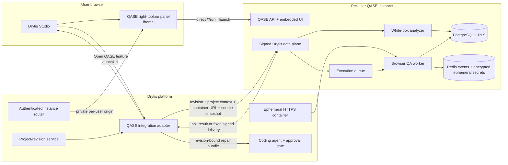

# QASE inside Drytis Studio: architecture and implementation guide

Status: QASE-side contract implemented and verified  
Audience: Drytis Studio, platform, project-runtime, and coding-agent teams

This guide explains how to expose QASE as a right-toolbar feature in Drytis
Studio without merging the two applications or sharing browser credentials.
QASE remains an isolated per-user service. Drytis owns authentication, instance
routing, the toolbar, immutable code revision, preview container, and repair
workflow.

## 1. Audit result

The current QASE architecture already provides the core integration boundaries:

- trusted per-instance organization/project/user binding;
- direct landing-to-workspace entry with no second QASE login;
- exact-origin iframe and same-origin API policy;
- a signed service API with nonce replay protection and business idempotency;
- black-box browser execution against an authorized HTTPS container;
- deterministic, non-executing white-box analysis of a bounded source snapshot;
- bounded combined findings, reports, and revision-bound repair prompts;
- polling plus optional fixed-target signed result delivery;
- distributed execution leases, cancellation, cleanup, and governance controls.

This hardening pass adds a canonical `containerUrl`, bounded `projectContext`, a
transport-independent request schema, and a dependency-free server adapter at
`integrations/drytis/qaseClient.js`. The legacy `previewUrl` remains accepted as
an alias, so existing integrations continue to work.

The Drytis repository is not present here. Therefore this repository cannot add
the actual Studio toolbar icon, provision and route per-user instances, access
Drytis project files, or apply code patches. The included adapter and OpenAPI
contract are the handoff boundary the Drytis team should consume.

## 2. Deployed architecture



Each Drytis user is routed to an isolated QASE instance for the authorized
project. Drytis creates a unique review UUID, and QASE creates the matching run
inside that instance. The instance receives its organization, project, and
actor binding only from trusted orchestration configuration. The QASE origin is
not a public multi-user endpoint; Drytis remains responsible for authentication
and cross-user isolation.

Isolation includes storage, not just the process URL. Give each instance its
own runtime volume and, when PostgreSQL is used, a separate database or distinct
tenant/project storage binding. The retained PostgreSQL adapter is project-
scoped, not an additional per-user authorization layer.

## 3. End-to-end request flow

```mermaid
sequenceDiagram
    actor U as User
    participant T as Drytis toolbar
    participant D as Drytis backend adapter
    participant Q as QASE signed API
    participant W as QASE worker
    participant R as Drytis instance router
    participant C as Drytis coding agent

    U->>T: Click QASE
    T->>D: Start/resume review for project revision
    D->>D: Package allowlisted UTF-8 source and SHA-256 manifest
    D->>Q: POST /reviews (signed raw bytes)
    Q->>Q: Validate project, revision, limits, nonce, and idempotency
    Q->>Q: Analyze source in memory
    Q->>W: Queue browser QA for containerUrl
    Q-->>D: ReviewResult + launchUrl
    D-->>T: Safe launch descriptor
    T->>R: Resolve the authenticated user's instance
    R-->>T: Private QASE origin
    T->>Q: Load direct launchUrl in iframe
    Q-->>T: Landing page; Begin transmission opens workspace
    loop Until terminal or awaiting input
        D->>Q: GET /reviews/{id} (fresh signed nonce)
        Q-->>D: Combined bounded result
    end
    D->>D: Validate terminal revision-bound repair bundle
    D->>C: Human-approved repair tasks
    C->>C: Patch branch, run project tests, deploy new immutable revision
    D->>Q: Create a new verification review
```

## 4. Data received by QASE

The canonical create body is:

```json
{
  "schemaVersion": "2026-08-1",
  "externalReviewId": "00000000-0000-4000-8000-000000000101",
  "project": {
    "id": "the-project-id-bound-to-this-qase-cell",
    "name": "Vice Shores",
    "revision": "commit:4e2d9b7"
  },
  "projectContext": {
    "description": "A collaborative full-stack application",
    "applicationType": "B2B SaaS",
    "primaryLanguage": "TypeScript",
    "frameworks": ["React", "Node.js"],
    "environment": "ephemeral-preview",
    "defaultBranch": "main"
  },
  "containerUrl": "https://preview-4e2d9b7.drytis.app/",
  "requestedChecks": { "blackBox": true, "whiteBox": true },
  "sourceSnapshot": {
    "schemaVersion": "2026-08-1",
    "project": {
      "id": "the-project-id-bound-to-this-qase-cell",
      "name": "Vice Shores",
      "revision": "commit:4e2d9b7"
    },
    "files": [
      {
        "path": "src/app.ts",
        "content": "export const app = createApp();\n",
        "sha256": "the-lowercase-sha256-of-the-exact-utf8-content",
        "sizeBytes": 32
      }
    ]
  }
}
```

Important boundaries:

- `project.revision` is mandatory and must identify immutable code.
- `containerUrl` is the canonical black-box target. `previewUrl` is deprecated
  but accepted for compatibility. If both are present, they must be identical.
- `projectContext` contains bounded labels only. It cannot carry commands,
  credentials, arbitrary environment variables, or repository URLs.
- QASE validates file paths, file/total byte limits, SHA-256, text encoding,
  allowlisted source types, duplicates, traversal, binary content, and likely
  secrets before analysis.
- Source content is analyzed in memory and is not stored in QASE PostgreSQL.

## 5. Data returned to Drytis

`ReviewResult` contains:

- `externalReviewId`, `qaseRunId`, project, revision, and optional context;
- a trusted-origin `launchUrl` for the embedded human workspace;
- lifecycle status: `ready`, `running`, `stopping`, `awaiting_input`,
  `completed`, `failed`, or `interrupted`;
- white-box coverage, structural findings, source digests, and limitations;
- black-box findings and the finalized QA report;
- aggregate severity counts and explicit truncation/page metadata;
- at most 80 revision-bound repair tasks;
- delivery and correlation metadata when fixed-target push is enabled.

QASE never returns raw source, credentials, cookies, chat transcripts, or
arbitrary browser state through the service contract.

The Drytis coding agent must consume `buildDrytisRepairBundle(result)` rather
than forwarding the entire response. That helper checks terminal status and
ensures every task is bound to the same immutable revision. It intentionally
does not apply code. Drytis must retain the human approval, branch, test,
deployment, and post-repair QASE verification gates.

## 6. Drytis backend adapter

Copy or package the complete `integrations/drytis` directory into the Drytis
backend. It must run only on the server because it holds the HMAC key. The
directory is self-contained apart from Node built-ins; see its local README for
the minimal handoff example.

```js
import { createDrytisQaseClient } from './qaseClient.js';

const qase = createDrytisQaseClient({
  qaseOrigin: process.env.QASE_CELL_ORIGIN,
  signingKey: process.env.QASE_DRYTIS_HMAC_KEY
});

const result = await qase.createReview(reviewRequest, {
  idempotencyKey: `qase:create:${reviewRequest.externalReviewId}`,
  correlationId: request.correlationId
});

const iframe = qase.launchDescriptor(result);
// Return iframe to the trusted Drytis toolbar component. Never return the key.

const terminal = await qase.waitForReview(result.externalReviewId, {
  signal: request.signal,
  onUpdate: updateToolbarStatus
});

if (terminal.status === 'completed') {
  const repairBundle = qase.buildRepairBundle(terminal);
  await submitForHumanApproval(repairBundle);
}
```

The adapter generates a fresh nonce for every request, signs the exact method,
request target, and raw JSON bytes, maps bounded protocol errors, rejects
redirects and oversized responses, polls with bounded backoff, and rejects a
launch URL outside the configured QASE origin.

## 7. Toolbar implementation

The Studio browser must never call `/internal/v1/drytis` and must never receive
the HMAC key. Its sequence is:

1. Add a project-scoped QASE item to the right toolbar.
2. On click, call the Drytis backend adapter with the active project and
   immutable revision.
3. Show `preparing`, `running`, `waiting for input`, `completed`, or `failed`
   from the backend's canonical result—not guessed client state.
4. Render only the adapter's validated launch descriptor.
5. Preserve `allow-forms`, `allow-scripts`, and `allow-same-origin` in the iframe
   sandbox so the QASE UI works. Do not grant camera, microphone, geolocation,
   clipboard, or filesystem permissions by default.
6. Destroy the iframe when the panel closes; reopening may reuse the durable
   review mapping and the same assigned instance.

Production QASE must set `QASE_DRYTIS_EMBED_ORIGIN` to the one exact Drytis
Studio origin. QASE emits a matching `frame-ancestors` CSP and does not use a
wildcard. The Drytis gateway must keep the per-user instance origin private.

## 8. Security, reliability, and scaling gates

Required before production rollout:

- PostgreSQL run store, distributed execution, Redis TLS, and shared nonce
  persistence; never use local mode for multi-replica production.
- Separate secrets for the service HMAC, Redis envelopes, database roles, and
  model access. No service secret may reach the browser.
- One exact Drytis API origin, one exact embed origin, and no user-selected
  callback URLs.
- Drytis must exclude `.env`, private keys, generated output, dependencies,
  binaries, VCS metadata, and secret-bearing files before snapshot creation.
- Contract tests generated from `docs/drytis-integration.openapi.yaml` must run
  in both repositories for every release.
- Drytis must persist `externalReviewId ↔ user ↔ project ↔ revision ↔ QASE instance`
  mappings and resume polling after restarts.
- Rate limits, project quotas, queue saturation behavior, metrics, alerts,
  canary cells, and rollback controls must be set per deployment.
- Repair prompts and page/source evidence are untrusted input. Require human
  approval and run repairs in an isolated branch/workspace.
- A successful repair is not complete until a new immutable revision passes a
  new QASE review.

## 9. Remaining enterprise extensions

The current bounded inline source contract is suitable for normal projects but
not very large monorepositories. A future compatibility version should add
encrypted object storage, content-addressed upload sessions, asynchronous
analysis jobs, malware/secret scanning, and explicit source deletion receipts.

Likewise, current push delivery is fixed-target and explicitly triggered. The
canonical reliable path is signed polling. High-volume asynchronous push should
use a PostgreSQL transactional outbox with leased workers, retry budgets,
backoff, dead-letter alerts, and signed Drytis receipts. These extensions should
be additive protocol versions, not changes to QA/SQA/Founder behavior.

For the exact wire schema and signing canonicalization, use
`docs/drytis-integration.openapi.yaml` and `docs/drytis-integration.md`.
