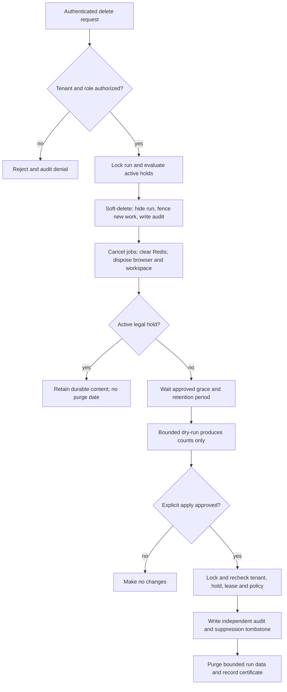

# Phase 10 — data governance and controlled deletion

Phase 10 defines the safety boundary for retaining and deleting Qase data in an
enterprise deployment. It replaces immediate destructive deletion with a
two-stage lifecycle, makes legal holds authoritative, and preserves a minimal
governance record outside the run data that may eventually be purged.

This is an application and operations baseline, not a statement of legal
compliance. Retention periods, lawful bases, data-subject procedures, residency,
litigation obligations and evidence admissibility require approval from the
organization's legal, privacy, security and records owners before production
use. Phase 10 does not enable an automatic production purge schedule.

## Scope and non-goals

In scope:

- classification and proposed retention defaults for data Qase already handles;
- tenant-scoped soft deletion followed by a separately authorized purge;
- run-scoped legal holds that override purge, plus the required design boundary
  for broader organization/project holds before tenant offboarding is enabled;
- an append-only governance audit and restore-suppression tombstones that
  survive deletion of the run aggregate;
- cancellation, credential, browser and workspace cleanup requirements;
- tenant offboarding and isolated backup-restore ordering;
- dry-run, explicit-apply, rollout, rollback and threat-model verification.

Out of scope:

- declaring GDPR, CCPA, HIPAA, SOC 2, FINRA or any other legal compliance;
- deciding a production retention schedule on behalf of a customer;
- automatically discovering a person in arbitrary page content or test output;
- configuring cloud KMS, backup vaults, WORM storage or a legal case system;
- running a production purge, tenant offboarding or destructive recovery drill;
- retaining target-site passwords, cookies or browser state as legal evidence;
- making the local JSON/local-owner mode an enterprise governance system.

Enterprise governance requires PostgreSQL persistence and Drytis identity. The
local mode remains suitable for development only: it has a single-owner trust
model, local JSON history and process-local artifacts, and cannot provide the
durable multi-actor hold, audit and purge guarantees described here.

## Data classes and proposed defaults

The values below are conservative starting points for policy review, not active
settings. Defining a policy must not by itself start a production sweeper.
Durations use database time and begin only after the stated terminal event.
Production policy must also define region, storage class, owner, minimum and
maximum duration, and the approved exception process.

| Data class | Examples | Proposed starting default | Hold behavior and deletion notes |
| --- | --- | --- | --- |
| Run content | Run metadata, messages, activities, plans, findings, evidence, reports and run events | 90 days after the run becomes terminal | Eligible for hold. Soft-delete first; purge only after grace and a final hold check. Treat all free text and URLs as customer-confidential and potentially personal. |
| Execution jobs | Requesting user, correlation ID, job payload, attempts, lease and terminal error metadata | Existing 30 days after terminal state | A hold on the related run prevents early cascade purge. Queue cleanup remains bounded to 1,000 rows. |
| Ephemeral credentials | Local in-memory vault values and encrypted Redis envelopes | One hour by default, never more than 24 hours | Never extended by legal hold and never copied to evidence or backups. Clear on terminal completion, soft deletion and offboarding; TTL is a backstop, not the primary delete mechanism. |
| Live browser material | JPEG frames, cursor events and streamed reasoning | Live connection/runtime only | Never retained for legal hold. Dispose immediately at soft delete. A screenshot exported by an authorized user becomes a separately governed evidence artifact. |
| Browser authentication state | Cookies, local storage and the last visited URL held for session restoration | Active/paused runtime only | Never retained for legal hold or backup. Dispose at soft delete, logout/offboarding and runtime expiry. Storage destruction is best effort on container/SSD media. |
| Runtime workspace | `.qase/workspaces/<run-id>` CleanSlate state and scratch files | Active/paused runtime only | Remove at soft delete after the runtime is closed. Use canonical path-containment checks; never delete a computed path outside the workspace root. |
| Drytis launch exchanges | Issuer, one-time token ID and expiry | Delete after token expiry | Not hold evidence. Existing exchange-time cleanup is a backstop; production should use a bounded maintenance task as well. |
| Qase auth sessions | Hashed session secret, user/project binding, expiry and revocation | Expiry, or seven days after revocation | Not hold evidence. Revoke immediately during offboarding; no raw session secret is stored. |
| Identity and membership | Drytis subject mapping, email, display name, role and status | Authoritative account lifetime plus an approved offboarding period | Minimize or pseudonymize only after dependent records and audit obligations are resolved. Do not delete parent rows before scoped child data. |
| Operational telemetry | Allowlisted request logs, metrics and alerts | 30 days of logs; longer aggregates only when approved | Not a substitute for governance audit. It must contain no prompts, evidence text, raw URLs, email, credentials, cookies or browser frames. |
| Governance audit | Hold, deletion, purge, restore-suppression and policy decisions | 400 days as an initial proposal | Retained independently from run content. A longer legal or contractual period may apply. Audit itself is access-controlled and data-minimized. |
| Suppression tombstones | Tenant, resource ID, purge time, policy version and deletion certificate | Maximum backup recovery horizon plus at least 90 days | Must outlive every backup that could reintroduce the resource. Never cascade from the deleted run. |
| Qualification/incident evidence | Capacity results, release IDs, correlation IDs, approvals and drill timelines | 400 days as an initial proposal | Store outside Git and production run tables. Sanitize first; a SHA-256 fingerprint proves integrity only, not author identity or custody. |
| Database backups | Encrypted full backups and WAL/PITR material | 35-day recovery horizon as an initial proposal | Immutable backups are expired, not surgically edited. Deleted records remain suppressed after restore until every containing backup expires. A hold may require a separately approved extension. |

Known credential masking protects values supplied through the Qase vault; it is
not general PII detection or DLP. Target URLs can contain query data, messages
can contain customer content, and finding evidence or tool errors can contain
page text. Governance must therefore treat the whole durable run aggregate as
sensitive even when no credential is present.

## Two-stage deletion lifecycle

### Stage 1: soft delete

Soft deletion is an access and execution boundary, not an erasure claim. In one
tenant-scoped transaction, the service must:

1. derive organization, project, actor and role from the authenticated request;
2. reject tenant, resource ID, actor or policy values supplied by the body or
   query as authorization inputs;
3. lock the run and serialize against execution admission and hold changes;
4. record deletion requester, request/correlation ID, reason code, policy
   version and timestamp without storing free-form sensitive content;
5. mark the run deleted so ordinary list/get/report/event routes no longer
   expose it, reject new turns, and request cancellation of queued or leased
   execution;
6. emit an append-only governance event outside the run's cascade graph; and
7. return a deletion-requested result, never a claim that erasure is complete.

Soft deletion may hide a run while it is held, because access minimization and
preservation are compatible. An active hold makes its physical purge date null
or ineligible. After a hold is released, calculate a new safe purge time that
does not bypass the approved post-release grace period.

External cleanup is not atomic with PostgreSQL. The cleanup state must remain
retryable and observable until all of the following have settled:

- a queued job is cancelled, or an active lease is fenced so a stale worker
  cannot commit later;
- the worker-local credential copy and encrypted Redis envelope are cleared;
- the runtime and Chromium context are disposed, including saved cookies and
  local storage;
- the last in-memory frame and Redis live-state entry expire or are removed; and
- the exact run workspace is removed after resolving and validating that its
  canonical path remains beneath the configured workspace root.

A soft delete now creates a tenant-scoped `qase_run_cleanup` row in `pending`
state in the same PostgreSQL transaction. In local execution, the API settles
credential and artifact removal together and records `completed` or a sanitized
`failed` machine code. In distributed execution, the API deliberately leaves
the row pending; the worker records its attempt only after its local secret,
credential-envelope and artifact cleanup has settled. Every state change uses
the PostgreSQL transaction clock and increments the bounded attempt counter.

This is an explicit cleanup gate, not a claim that Redis publication reaches an
offline worker or that every historical worker volume has been inspected.
Deployments with persistent worker volumes must run an external, inventory-aware
reconciler and alert on old pending/failed rows. Phase 10 does not ship that
scheduler. Credential TTLs and ephemeral-volume destruction remain containment
backstops, not evidence of completed cleanup.

A Redis, worker or filesystem failure must not unhide the run or silently mark
cleanup complete. The application stores only allowlisted machine codes in the
cleanup record and count-only audit metadata; raw exception messages, paths,
URLs, run content and credentials are excluded. A manual `cleanup-attest`
command records an explicit operator result but performs no cleanup itself. Mark
it `completed` only after the external ticket/evidence proves every storage
location in scope was checked; use `failed` with a sanitized error code when it
was not. Purge remains blocked until the durable state is `completed`.

### Stage 2: permanent purge

Purge is a maintenance operation, not a normal browser API action. It runs with
a narrowly scoped deployment identity in a reviewed change window. The runtime
role remains non-superuser, does not own tables, and does not have `BYPASSRLS`.

For each small batch, the purger must:

1. select only exact tenant-scoped soft-deleted candidates whose approved
   retention and grace periods have elapsed;
2. lock each candidate and recheck organization/project scope, policy version,
   active organization/project/run holds, cleanup state and execution lease;
3. fail closed if any dependency, hold lookup or policy decision is uncertain;
4. insert the independent suppression tombstone and a pending purge audit entry
   before removing data, in the same database transaction where possible;
5. remove the run aggregate through its reviewed cascade, never with an
   unbounded organization-wide delete;
6. finalize a data-minimized deletion certificate containing tenant-scoped
   per-table counts, a deterministic SHA-256 manifest, policy version, database
   timestamp and request/change reference; and
7. remain idempotent across retry, timeout, failover and process crash.

The audit and tombstone tables must not reference `qa_runs` with `ON DELETE
CASCADE`. Application roles may append approved records and read only the scope
they are authorized to inspect; ordinary application code cannot update or
delete historical audit rows. Database grants, an external immutable copy and
signed exports are deployment responsibilities. A local hash chain or digest
can reveal alteration but does not by itself prove custody or signer identity.

## Legal hold precedence

A hold always overrides retention expiry, user deletion, tenant offboarding,
storage pressure and purge throughput targets. Phase 10 implements active
run-level holds. A production tenant-offboarding workflow must add authoritative
organization/project holds before it is enabled; the most specific release may
never cancel an active broader hold once those scopes exist.

- Only an authenticated owner/admin or an approved records-management service
  may place or release a hold. Production release should require the
  organization's two-person approval workflow even if Qase receives one signed
  command.
- Store a bounded reason code and opaque external case reference, not legal
  narrative or evidence content. Record placed/released actor and time as
  immutable events.
- Hold records and their history remain tenant scoped but do not cascade from
  held resources. The runtime role cannot rewrite their history.
- Hold creation/release and purge selection must use a common transaction lock
  or advisory-lock key so a concurrently placed hold always wins or causes the
  purge to abort.
- A hold preserves the minimum durable run/evidence data required by policy. It
  does not preserve plaintext credentials, session cookies, browser local
  storage, transient frames, live Redis events or active authentication
  sessions.
- Never depend on a backup as the only held copy. Keep held records available in
  the governed primary/archive tier and test their readability periodically.

## Authorization model

| Principal | Allowed governance actions |
| --- | --- |
| Viewer | Read only the run data already allowed by project policy; no deletion, policy, hold, purge or audit export. |
| Developer | Create and operate runs. If organization policy permits, request a reversible soft delete; never release a hold, apply retention policy, permanently purge, export governance audit or offboard a tenant. |
| Admin | Soft-delete project runs and manage holds/policies within the approved organizational delegation. No direct database deletion. |
| Owner | Approve tenant-wide policy/offboarding and the same governed actions as admin. Production purge still requires the deployment change workflow. |
| Governance maintenance identity | Perform bounded dry-run/apply for explicitly allowlisted tenant scopes. It receives no browser, model, Drytis launch or credential-vault secret. |
| Migrator identity | Apply reviewed forward schema migrations only; it is not the runtime purger. |
| Auditor/records service | Read the minimum hold/audit view required by policy; cannot mutate runs or release holds unless separately authorized. |

Qase's existing project authorization is not per-run ownership. A customer that
requires creator-only visibility, custom roles or separation of duties must add
that authorization model before relying on Qase for differently restricted
records. A viewer who can read a project can otherwise read its available run
content, including live views, so sensitive test accounts should use dedicated
projects and least-privilege membership.

## Dry-run and explicit-apply safeguards

Dry-run is the default and reports only counts, age buckets, hold blocks and
sanitized identifiers. It must execute the same candidate and hold predicates
as apply, without deleting or extending leases.

Apply requires all of the following outside application source control:

- an exact tenant/cell allowlist and deployment environment match;
- a time-bounded change reference and an exact acknowledgement value;
- owner/data-governance approval plus the platform operator approval;
- a fixed maximum batch size, maximum total rows, duration and transaction
  timeout that cannot be raised during the run;
- healthy database/queue dependencies, no migration in progress and a verified
  recent restore test;
- captured pre-run dry-run counts and expected post-run counts; and
- abort thresholds for unexpected holds, tenant mismatch, active leases,
  cleanup errors, replication lag, lock time or SLO degradation.

Never log an authorization header, database URL, run content, target URL,
credential, cookie, browser frame or free-form evidence during dry-run/apply.
Run destructive verification first against synthetic tenants in an isolated
staging cell. Phase 10 ships no automatically scheduled production sweeper.

### Shipped operator command

The command is constructor-bound to the bootstrap organization/project from the
trusted process environment; it does not accept tenant IDs on the command line.
Apply migration 007 separately before using it. Available actions are:

| Command | Behavior |
| --- | --- |
| `npm run data:governance -- runs-preview` | Read-only bounded preview of soft-deleted runs beyond the grace period for `QASE_GOVERNANCE_POLICY_VERSION`; excludes active holds and work. |
| `npm run data:governance -- auth-preview` | Read-only counts for expired/revoked Qase sessions and expired Drytis exchanges. |
| `npm run data:governance -- runs-purge --apply` | Bounded parent-run purge with an immutable event and restore-suppression tombstone in the same transaction. Requires a unique `QASE_GOVERNANCE_IDEMPOTENCY_KEY` for the reviewed batch. |
| `npm run data:governance -- auth-cleanup --apply` | Bounded expired-auth cleanup with count-only audit metadata. |
| `npm run data:governance -- hold-place --apply` | Place one active run hold named by `QASE_GOVERNANCE_RUN_ID`. |
| `npm run data:governance -- hold-release --apply` | Release one active run hold while preserving its append-only history. |
| `npm run data:governance -- cleanup-attest --apply` | Record one explicit cleanup result for `QASE_GOVERNANCE_RUN_ID`; requires `QASE_GOVERNANCE_CLEANUP_STATUS=completed\|failed`, and a failed result also requires `QASE_GOVERNANCE_CLEANUP_ERROR_CODE`. It does not delete artifacts. |

Every apply command requires both
`QASE_GOVERNANCE_ACK=I_APPROVE_QASE_DATA_LIFECYCLE` and a bounded
`QASE_GOVERNANCE_REFERENCE_ID` from an external case/change system. Batch size
is hard-capped at 1,000 by the repository. These code safeguards do not replace
the two-person production approval, allowlist, maintenance window or independent
backup/restore checks above. For cleanup completion, the external reference is
the evidence link: the operator must reconcile the pending record and worker
inventory before applying it. Re-running an already completed cleanup is
idempotent; failed attempts remain visible and continue to block purge.

Soft deletion writes a content-free pre-cleanup audit with fixed per-table
counts and the number of jobs fenced by the delete. Its digest covers the
tenant, project, run, policy and pre-delete table counts; the separately reported
fenced-job count is not part of that digest. Permanent purge then counts the
selected runs, messages, activities, plan items, findings, reports, run
events and execution jobs in tenant scope before cascade deletion. Its canonical
certificate input is fixed-order UTF-8 JSON with exactly `version`,
`policyVersion`, lexicographically sorted canonical `runIds`, and
`resourceCounts` (`runs`, `messages`, `activities`, `planItems`, `findings`,
`reports`, `runEvents`, `executionJobs`). The lowercase SHA-256 is written to
each suppression tombstone and the purge audit event, and returned to the
operator with the counts. No prompt, URL, evidence or other run content enters
the certificate. The digest is a deterministic reconciliation aid, not a
signature or proof of custody.

## Tenant offboarding order

Offboarding is broader than run deletion and needs its own approved change:

1. Resolve the authoritative Drytis placement and record the exact cell. Put the
   placement/tenant into draining or suspended state so no new launches arrive;
   do not guess another cell or move data implicitly.
2. Revoke active Qase sessions and reject new job admission for the organization
   and its projects.
3. Drain or cancel active jobs and fence outstanding worker leases.
4. Place or confirm all required legal holds and complete separately approved
   exports. Never create an unreviewed backup merely to avoid deletion.
5. Soft-delete in project-sized batches, clear credential envelopes, dispose
   browsers/live state and remove contained workspaces.
6. Run tenant-scoped dry-run reports and reconcile counts, holds, imports,
   identity mappings and audit entries.
7. After approved retention/grace periods, apply bounded purge batches with the
   same final hold checks used for individual runs.
8. Pseudonymize or remove identity/membership and project/organization rows only
   after all dependent records, holds and audit obligations are resolved. Keep
   suppression tombstones longer than the backup horizon.
9. Remove placement metadata and tenant-specific secrets/keys only when no held
   data or recoverable backup still requires them. Crypto-shredding is not a
   substitute for hold review.
10. Issue a sanitized offboarding certificate and continue restore suppression
    until every backup capable of containing deleted data has expired.

## Backup restore suppression

Immutable backups normally cannot support immediate row-level erasure. The
governed promise is therefore live/replica purge plus suppression on restore,
followed by natural encrypted-backup expiry. Document the maximum backup age in
the retention policy and communicate that boundary accurately.

A tombstone stored only in the primary database is insufficient: restoring a
backup taken before deletion also restores a world in which the tombstone does
not exist. Replicate signed tombstone and active-hold exports to an independent,
access-controlled governance store whose retention exceeds the oldest backup.

Every restore follows this order:

1. Restore into an isolated network with no user, Drytis, worker or target-site
   access. Use separate temporary credentials and disable outbound execution.
2. Verify backup provenance, image/migration checksums, encryption and RLS
   before inspecting customer rows.
3. Fetch the authoritative post-backup tombstone and hold ledger from the
   independent governance store. If it is unavailable or its signature/checksum
   fails, stop and destroy or quarantine the restore.
4. Reapply all deletions and holds newer than the backup watermark. Revoke
   restored auth sessions and remove any transient queue state.
5. Reconcile deletion certificates, tenant counts and hold coverage, then run
   cross-tenant/default-deny tests and signed synthetic canaries.
6. Obtain two-person promotion approval. Connect traffic only after suppression
   is complete; retain the previous environment for the approved observation
   window without allowing it to serve deleted data.

Legal holds can require extended backup retention, but backups must never be the
sole searchable held copy. Backups contain transcripts, URLs and findings even
though ephemeral credentials must never enter them; encrypt, restrict and audit
every restore/export, and expire media according to its approved schedule.

## Rollout

1. Obtain written owners for every data class and approve policy bounds without
   enabling apply.
2. Apply forward-compatible schema/grant changes with the separate migrator.
   Keep old read paths working and create no purge schedule.
3. Deploy governance audit in observe-only mode. Verify actor, tenant, request
   correlation, payload minimization, RLS and immutable export behavior.
4. Enable soft deletion for synthetic tenants, then a small internal canary.
   Confirm hidden data cannot be read or executed and that Redis/browser/
   workspace cleanup settles.
5. Exercise duplicate requests, worker crash, Redis outage, concurrent hold and
   isolated backup restore in staging. Reconcile every certificate and count.
6. Enable production soft deletion only after dashboards, alerts, support
   recovery and the grace policy are approved.
7. Keep permanent purge manual and dry-run-first. Any future scheduler is a new
   explicitly approved phase with its own failure and capacity qualification.

## Rollback

Disable purge apply first. Leave governance schema, soft-delete markers, holds,
audit entries and suppression tombstones in place; do not drop them during an
incident. Roll application processes back to the previous signed image only if
that version continues to exclude `deleted_at` rows and cannot bypass holds.

A soft-deleted run may be restored during its grace period only by an authorized
owner/admin, with an audit event, no completed purge and no policy conflict.
Never restore a permanently purged run from backup as an application rollback.
If external cleanup failed, keep the run hidden and retry cleanup rather than
making it visible. If governance state is inconsistent or the independent
tombstone ledger is unavailable, fail closed and pause deletion/restore work.

## Threat-model verification

Automated tests and staging drills must prove all of the following before apply
is considered:

- cross-organization and cross-project list, hold, delete, restore, audit and
  purge attempts return no data and make no changes;
- organization/project/actor/role values in body, query or untrusted headers
  cannot replace the authenticated Drytis context;
- viewers cannot mutate; developers cannot place/release holds, change policy,
  purge, export audit or offboard; the maintenance identity cannot browse or
  obtain credential values;
- soft deletion is idempotent, hides every read/report/SSE path, rejects new
  turns and produces exactly one attributable governance outcome;
- a hold placed concurrently with purge always blocks the purge, broader holds
  override narrower releases, and releasing a hold cannot skip the grace period;
- an active worker loses the right to commit after deletion fencing, while
  duplicate cancellation and expired leases reach a deterministic terminal
  result;
- cleanup removes worker-local and Redis credentials, live frame/browser state
  and only the exact contained workspace, including retry after partial failure;
- purge removes all reviewed run children/jobs while retaining independent
  audit, hold history and suppression tombstones;
- crash/retry before or after each transaction boundary does not double-purge,
  omit the certificate, resurrect a run or cross a tenant boundary;
- audit/dry-run/certificates contain no raw message, prompt, URL, finding
  evidence, email, token, secret, cookie, browser frame or upstream response;
- runtime and migrator roles remain non-superuser, and the runtime/purger cannot
  bypass RLS, own tables or alter historical audit entries;
- an isolated backup predating deletion cannot be promoted until newer
  tombstones and holds are independently verified and reapplied; and
- batch caps, transaction timeouts, abort signals and SLO thresholds stop a
  purge safely without expanding limits during the incident.

Manual review must additionally cover incident access, records-owner approval,
backup-vault policy, key lifecycle, data residency, customer notification and
the accuracy of deletion wording presented to users.

## Explicit limitations

- This phase is a technical control baseline, not legal advice, certification
  or proof that any selected retention period is lawful.
- No automatic production sweeper, real tenant purge, offboarding, backup
  deletion, key destruction or cloud policy change is authorized by this phase.
- The shipped hold repository is run-scoped. Organization/project hold storage
  and coordinated control-plane offboarding remain a separately approved phase.
- Local mode is development-only for governance and cannot make the enterprise
  audit/legal-hold guarantees above.
- Qase cannot reliably discover or erase a person from arbitrary screenshots,
  page text or prose without a separately designed data-subject workflow.
- Storage deletion is not physical media zeroization. Immutable backups expire
  on their approved schedule and remain access-controlled/suppressed meanwhile.
- Project-wide authorization is not per-run ownership or custom-role isolation.
- Tamper-evident hashes are not an external timestamp, signature, WORM archive
  or complete evidence-custody system.
- Production acceptance requires policy approval and measured staging evidence;
  source code and passing unit tests alone do not authorize destructive work.
