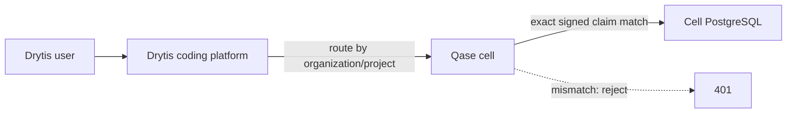
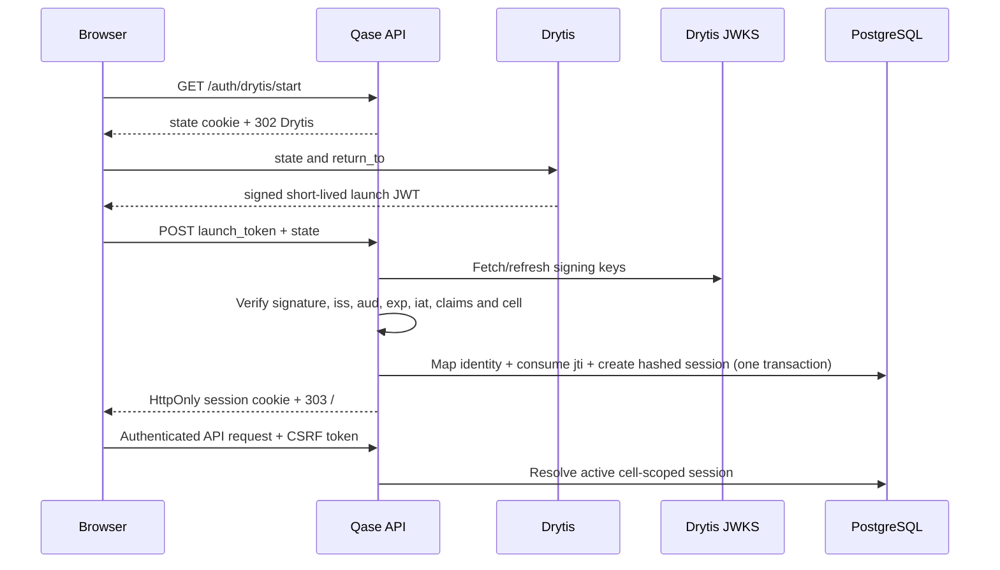

# Phase 3: Drytis identity integration

> Historical migration record. The browser login/SSO implementation described
> here has been superseded by Drytis-owned per-user Qase instances. Migration
> `004_drytis_identity_sessions.sql` remains immutable database history, but the
> current application has no Qase login page or Qase session cookie.

Scope: signed Drytis launch SSO, external identity mapping, shared PostgreSQL
sessions and authenticated actor attribution. This phase does not add a job
queue, browser-worker leases, a broker, global tenant discovery or a secrets
manager.

## Cell boundary

Each Qase deployment is pinned to the organization and project configured by
the Phase 2 bootstrap variables. Drytis routes a user to that cell. A signed
token for any other organization/project ID or slug is rejected, so neither an
HTTP header nor a request body can select a tenant.



This is a deliberate cell architecture: replicas inside a cell share the same
database-backed sessions and run data. Scaling across many organizations is
performed by Drytis routing to multiple cells, rather than trusting arbitrary
tenant identifiers at one global HTTP boundary.

## Browser sign-in flow



The launch token is never placed in a URL or persisted. The exchange is bound
to the browser that initiated it using a short-lived `Secure`, `HttpOnly`,
`SameSite=None` state cookie. Each `(issuer, jti)` can be consumed only once.

## Launch JWT contract

Drytis signs compact JWTs with `RS256` or `EdDSA`. Qase accepts only a key from
the configured HTTPS JWKS endpoint and refreshes the cache when a `kid` changes
or signature verification fails.

Required protected header values:

- `alg`: `RS256` or `EdDSA`
- `kid`: identifier present in the current Drytis JWKS
- `typ`: when present, exactly `JWT`

Required claims:

- `iss`, `aud`, `sub`, unique one-time `jti`, `iat`, `exp`
- canonical `user_id`, `email`, `name`
- `role`: `owner`, `admin`, `developer` or `viewer`
- `organization`: canonical `id`, DNS-safe `slug`, display `name`
- `project`: canonical `id`, DNS-safe `slug`, display `name`

Tokens may live for at most five minutes. The issuer and audience must exactly
match configuration. Qase normalizes email casing and rejects malformed UUIDs,
unsafe names, unsupported roles, long-lived tokens, unknown keys and cell
mismatches.

## Persistence and authorization

Migration `004_drytis_identity_sessions.sql` adds:

- `drytis_identities` for stable issuer/subject/user mappings per organization
- `drytis_token_exchanges` for one-time JTI replay protection
- `qase_auth_sessions` containing only SHA-256 hashes of random session secrets

All three tables use forced row-level security. A session cookie carries an
untrusted organization/project envelope only so Qase can establish a default-
deny RLS scope; access still requires the random secret hash, exact cell match,
active user, active membership, active organization and active project.

Mutating API calls retain the existing same-origin and CSRF checks. Viewers are
read-only; configuration changes require an owner or admin. Developers may run
tests and manage project runs. Logout
revokes the PostgreSQL row immediately, so cookie replay fails on every API
replica. Durable user events use the authenticated Drytis `user_id`; agent and
system events remain explicitly attributed as agent/system.

## Configuration

Drytis mode requires all of the following:

```text
QASE_RUN_STORE=postgres
QASE_AUTH_MODE=drytis
QASE_PUBLIC_URL=https://qase.example.com
QASE_DRYTIS_LOGIN_URL=https://studio.drytis.ai/integrations/qase/launch
QASE_DRYTIS_ISSUER=https://identity.drytis.ai
QASE_DRYTIS_AUDIENCE=qase-production
QASE_DRYTIS_JWKS_URL=https://identity.drytis.ai/.well-known/jwks.json
```

Run migration 004 with the dedicated migrator credential before deploying the
new API version. The runtime database role remains non-owner, non-superuser and
without `BYPASSRLS`.

## Key rotation

Drytis must publish the new public key before signing tokens with its `kid`.
Keep the previous public key in JWKS until every token it signed has expired
plus clock tolerance. Qase refreshes on an unknown `kid` and also retries once
after a failed signature, allowing rotation without an API restart. Private
signing keys never enter Qase configuration.

## Rollback

1. Stop accepting new Drytis launches.
2. Set `QASE_AUTH_MODE=local` and restore access to the existing private local
   owner-auth file.
3. Restart Qase; leave `QASE_RUN_STORE=postgres` unchanged.
4. Existing Drytis session rows become unused. Revoke or purge them later under
   a separately approved retention procedure.

Migration 004 is forward-only and need not be reversed to roll back the auth
mode. Do not drop identity/session tables during an incident.

## Limitations retained

- A Qase process still serves one configured organization/project cell.
- Browser execution and credential values remain process-local.
- No worker lease, queue or cross-process SSE broker exists yet.
- Authorization is project-wide; per-run ownership and custom roles are not yet
  implemented.

Phase 3 establishes trustworthy identity. It does not by itself make browser
execution horizontally scalable or claim million-user readiness.
