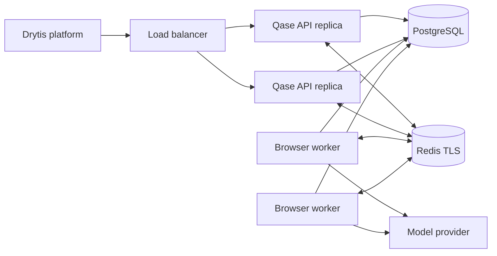
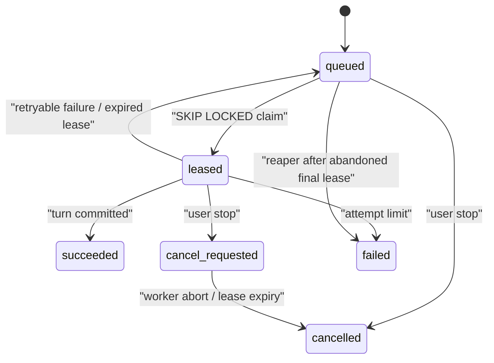

# Phase 4: distributed execution plane

Scope: durable execution jobs, leased browser workers, cross-server live events,
encrypted credential handoff, cancellation and crash recovery. Local execution
remains the default rollback path.

## Resulting cell architecture



API replicas authenticate users, validate input, persist user messages and
enqueue work. They do not launch Chromium in distributed mode. Worker processes
claim one job at a time and run the existing Qase agent/browser runtime. Both
roles use the same configured Phase 3 organization/project cell.

PostgreSQL is authoritative for runs, jobs, attempts, leases and cancellations.
Redis is deliberately non-authoritative: it carries live SSE events, browser
frames and encrypted short-lived credentials. A Redis interruption can make the
live view stale, but reconnecting reloads durable run state from PostgreSQL.

## Job lifecycle



Only one queued/leased/cancellation job may exist per run. Claims use
`FOR UPDATE SKIP LOCKED`; each claim receives a random lease token bound to the
worker identity. Heartbeats extend the lease. Completion, failure and heartbeat
updates require the same worker ID and lease token, so a stale worker cannot
acknowledge another worker's lease.

Expired leases are retried with bounded exponential backoff. After the maximum
attempts, a healthy worker reaper marks the job failed and writes a visible
system error/status to the run. Stop requests cancel queued jobs immediately or
become `cancel_requested`; the lease heartbeat then aborts the active agent.
Terminal job records are retained for `QASE_JOB_RETENTION_DAYS` (30 by default).
Claim cycles remove no more than 1,000 expired records at a time so cleanup
cannot turn into an unbounded worker transaction.

## Live browser and events

Each cell has one Redis pub/sub channel. Envelopes contain a source-replica ID,
session ID, event type and payload. A replica delivers its own event locally and
ignores the Redis echo, preventing duplicate UI messages. Every API replica
subscribes to the channel and retains only the latest frame/running state per
active run for SSE reconnects. Individual envelopes are capped at 2 MiB.

Durable transcript, finding, plan, report and status changes still commit to
PostgreSQL before publication. Redis never becomes a second run database.

## Credential handoff

Credential values never enter a job payload, PostgreSQL, logs, events or model
messages. The API normalizes the existing placeholder names, encrypts the values
with AES-256-GCM and stores the authenticated envelope in Redis with a bounded
TTL. The encryption additional-authenticated-data binds ciphertext to the exact
organization, project and run key.

After claiming a job, the worker decrypts credentials into its existing local
in-memory vault. The browser bridge substitutes placeholders exactly as before.
The worker clears local plaintext in `finally`; shared ciphertext is deleted
when the run becomes done, idle or errored and is retained only while waiting
for another user answer.

`QASE_SECRETS_MASTER_KEY` must be the same base64url-encoded 32-byte value on
every API and worker in the cell. Store it in the infrastructure secrets
manager, never in Git, an image, a job payload or ordinary application config.
A key change makes existing short-lived envelopes unreadable, so rotate only
after draining active jobs and expiring the credential TTL.

## Deployment order

1. Provision highly available PostgreSQL and TLS Redis reachable only from the
   Qase network.
2. Apply migration 005 with the separate migrator credential.
3. Put `QASE_REDIS_URL` and `QASE_SECRETS_MASTER_KEY` in the secrets manager.
4. Deploy API replicas with:

   ```text
   QASE_RUN_STORE=postgres
   QASE_EXECUTION_MODE=distributed
   ```

5. Wait for `/readyz` to report ready. Readiness checks PostgreSQL, Redis,
   encrypted-vault connectivity and the job table.
6. Start worker replicas from the same immutable release:

   ```text
   npm run worker
   ```

7. Submit a non-destructive canary run, watch live frames, stop it once, and
   verify queue/job status before increasing traffic.

API and worker replicas must share the same model configuration, bootstrap cell
IDs, database, Redis, Drytis identity settings and secrets key. Browser workers
need Chromium and substantially more CPU/RAM than API replicas. Scale the two
groups independently.

## Scaling guidance

- Keep API processes stateless and place them behind an HTTPS load balancer.
- Run one active browser turn per worker process. Scale workers from queue depth
  and oldest queued age, not API request rate.
- Size PostgreSQL pools per process so `replicas × pool max` stays below the
  database connection budget. A connection pooler is recommended at high scale.
- Use Redis Cluster/Sentinel or a managed HA service with TLS, authentication,
  memory limits and eviction monitoring.
- Spread workers across failure zones and use graceful termination longer than
  the worker lease.
- Alert on queued age, expired leases, exhausted attempts, Redis publish errors,
  PostgreSQL readiness and worker restart rate.

## Delivery semantics and safety

Execution jobs are at-least-once. A process can crash after an external browser
action but before its next durable commit, so retry may repeat that action.
Qase's QA prompt remains non-destructive; do not use this phase to approve
purchases, delete production data or perform other irreversible operations.
Exactly-once external browser side effects are not technically possible without
cooperation/idempotency from the target application.

Optimistic run versions fence conflicting durable writes, while job lease tokens
fence acknowledgements. These protect Qase state but do not convert arbitrary
websites into transactional systems.

## Rollback

1. Stop accepting new runs and let current workers drain.
2. Stop worker processes.
3. Set `QASE_EXECUTION_MODE=local` on exactly one API instance.
4. Remove that instance from the multi-replica load-balanced group and restart.
5. Keep PostgreSQL selected; queued Phase 4 jobs remain for investigation.

Do not run multiple local-execution API instances against one cell. Do not drop
migration 005 during rollback. Redis credential envelopes expire automatically;
clear them only through an approved incident/retention procedure.

## Limitations retained

- Scheduling is cell-local; there is no global cross-cell control plane yet.
- Redis pub/sub has no replay, although durable run state heals after reconnect.
- Browser side effects are at-least-once across crash recovery.
- Model configuration still must be deployed consistently to every worker.
- Automated autoscaling policies and full metrics export are deployment work,
  not hard-coded infrastructure assumptions in this repository.
