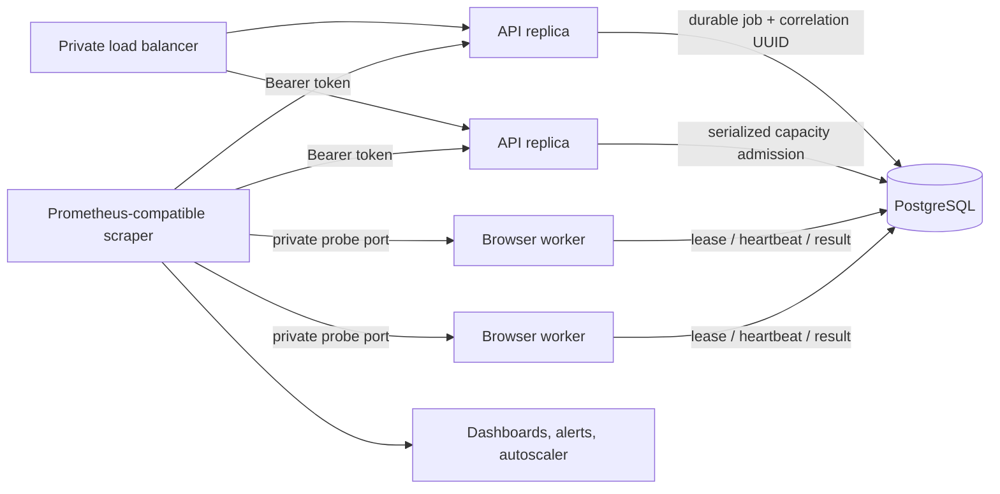

# Phase 5: operational readiness and overload protection

Scope: low-cardinality telemetry, request/job correlation, durable queue
admission, worker probes, autoscaling signals, SLOs and incident procedures for
each Phase 4 Qase cell. This phase does not add a global control plane, deploy
infrastructure automatically, or claim that one cell serves one million users.

## Operational data flow

Every HTTP response receives a server-generated `X-Request-Id`. For distributed
turns that UUID is stored in `qa_execution_jobs.correlation_id` and restored in
the worker async context. It can join API and worker diagnostics without using
email, URL, prompt text, run ID or credential data as a metric label.

## Metrics security and cardinality

`/metrics` is absent unless `QASE_METRICS_TOKEN` is configured with at least 32
bytes. Scrapers must send it as a bearer token over a private TLS or service-mesh
connection. Do not expose API or worker probe ports directly to the internet.

The source exports only bounded labels: HTTP method, normalized Express route,
status class and the fixed execution-job states. Concrete run IDs, request IDs,
users, target hosts, errors and model text are intentionally excluded. This
keeps telemetry cost predictable and prevents customer data from entering the
metrics system.

Key series:

| Metric | Meaning |
| --- | --- |
| `qase_http_requests_total` | Requests by normalized route and status class |
| `qase_http_request_duration_seconds` | Per-replica request latency histogram |
| `qase_http_mutations_in_flight` | POST/PUT/PATCH/DELETE work executing now |
| `qase_http_overload_rejections_total` | Local concurrency guard rejections |
| `qase_execution_jobs` | Authoritative job count by durable state |
| `qase_execution_oldest_queued_age_seconds` | Oldest queue wait, the primary worker-pressure signal |
| `qase_execution_expired_leases` | Worker leases past their heartbeat deadline |
| `qase_process_resident_memory_bytes` | Process resident memory |

## Two overload boundaries

The API guard limits concurrent mutating requests per replica with
`QASE_MUTATION_MAX_IN_FLIGHT`. Excess work receives `503` and `Retry-After: 1`;
read requests and probes remain available. The load balancer or Drytis caller
should retry with exponential backoff and jitter.

The queue guard is authoritative across all API replicas. Enqueue transactions
take a cell-scoped PostgreSQL advisory transaction lock, count only active jobs,
and reject admission at `QASE_QUEUE_MAX_ACTIVE_JOBS`. Completed history does not
consume capacity. This is an emergency ceiling, not the normal scaling target.

## Worker orchestration

Each worker listens on `QASE_WORKER_PROBE_HOST:QASE_WORKER_PROBE_PORT`:

- `/healthz` reports only process liveness.
- `/readyz` requires the worker loop to be started, not draining, and the queue
  database check to pass.
- `/metrics` uses the same bearer token and exposes authoritative queue signals.

On `SIGTERM`, readiness becomes unavailable before the active agent is aborted
and services close. Set the orchestrator termination grace period above the
configured worker lease so stale work is recovered by normal lease expiry even
if a process must be killed.

## Initial service objectives

Use these as starting objectives, then revise from measured product traffic:

- API availability: 99.9% successful non-overload requests per cell monthly.
- API latency: 95% of ordinary non-SSE API requests below 500 ms, excluding
  model/browser execution time.
- Queue start latency: 95% of admitted jobs leased within 30 seconds.
- Durable execution: fewer than 0.1% of jobs end in `failed` from worker
  infrastructure, excluding target-site/model failures.
- Credential handling: zero plaintext credentials in database, job payload,
  events, logs, metrics or source artifacts.

## Alerts and dashboards

Page when oldest queued age exceeds two minutes for ten minutes, expired leases
remain above zero for five minutes, or readiness fails on more than one replica
in a cell. Ticket sustained 5xx above 1%, overload rejections, terminal worker
failures above the objective, Redis publish errors, database pool saturation or
resident-memory growth.

The minimum dashboard should show request rate/error/latency, mutation
concurrency, overload rejections, jobs by state, oldest queued age, expired
leases, API/worker readiness, restarts, CPU, memory, PostgreSQL connections and
Redis connectivity.

## Autoscaling policy

Scale API replicas from CPU plus mutation concurrency, keeping normal peak below
60% of each replica's configured guard. Scale browser workers from oldest queued
age and queued depth. A safe starting rule is desired workers =
`ceil(queued jobs / 2) + leased jobs`, bounded by provider, browser, database and
budget limits. Keep at least two API and two worker replicas across failure
zones for a production cell.

Do not autoscale solely from HTTP request rate: browser turns are the expensive
resource. Verify that `replicas × QASE_DATABASE_POOL_MAX` stays within the
database connection budget before raising replica maxima.

## Rollout

1. Apply migration 006 with the separate migrator credential.
2. Store one metrics token per cell in the infrastructure secrets manager.
3. Deploy API replicas with conservative concurrency and queue limits.
4. Deploy workers with private probe listeners and a termination grace period
   longer than the lease.
5. Confirm unauthorized metrics requests fail, then connect the private scraper.
6. Run a canary, verify its response/job correlation UUID, queue metrics and
   worker readiness transition during a controlled drain.
7. Create dashboards and alerts before increasing traffic or scaling maxima.

## Rollback

Remove `QASE_METRICS_TOKEN` to disable metrics immediately. Raise the mutation
or queue limits only as a short incident mitigation after checking downstream
capacity. To roll back the release, drain Phase 5 workers and deploy the Phase 4
commit; leave migration 006 in place because its nullable column is backward
compatible. Do not drop the column during an incident.

## Remaining limits

- Metrics are process/cell local; a deployment-owned collector aggregates them.
- The repository does not create Kubernetes, cloud load balancers, dashboards
  or autoscaling resources because those depend on the boss's platform.
- There is still no global cell registry, placement service or cross-region
  tenant router. Those belong to a separately approved control-plane phase.
- Million-user capacity requires load tests, failure drills, provider quotas,
  database sizing and many cells; code structure alone is not proof of capacity.
