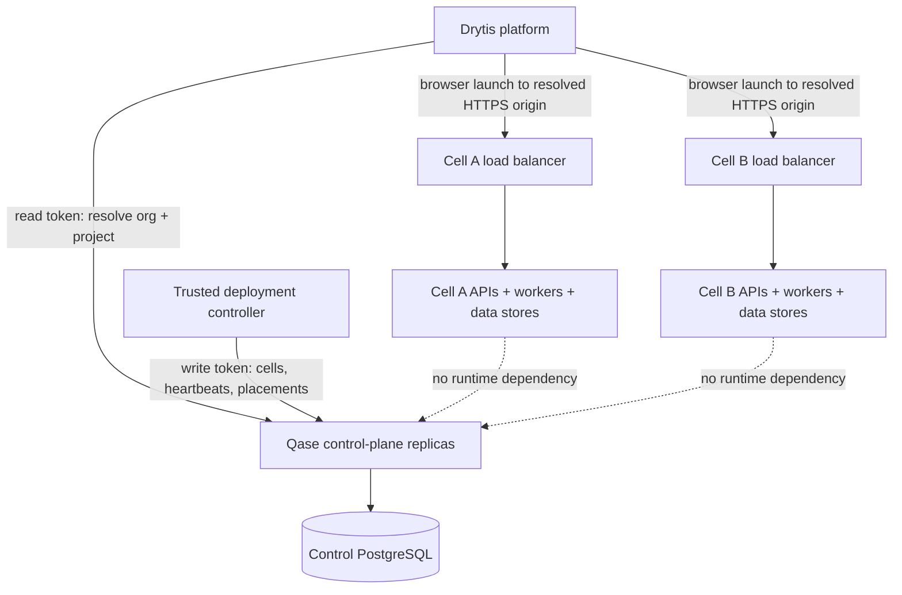
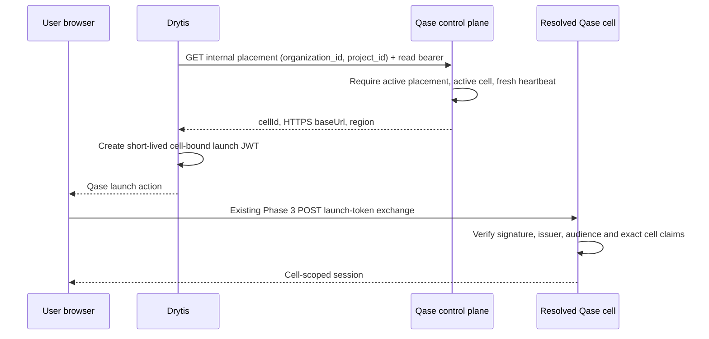

# Phase 6: global cell control plane

Scope: a separate internal service and PostgreSQL database for Qase cell
registration, health observations, organization/project placement and Drytis
routing resolution. It never stores run content, users, findings, browser state,
model traffic or credential values.

## Architecture



The control database is globally scoped routing metadata. Every Qase cell keeps
its Phase 2–5 database, Redis, secrets key and tenant boundary. There is no
cross-cell run query and no shared browser queue. A control-plane outage blocks
new placement/resolution but existing users already connected to a known cell
continue using that cell.

Cell and placement mutations append a `qase_control_events` record in the same
database transaction. Events contain only entity IDs, cell region/status/capacity,
selected cell and the server-generated correlation UUID. Heartbeats are excluded
to avoid audit noise; no request body, bearer token or customer content is stored.
Archive and retain this table under the platform's compliance policy rather than
deleting it from application request paths.

## Drytis call flow



Drytis must never send the control read token to the browser. It resolves the
placement server-to-server, signs the existing Phase 3 launch JWT for that exact
cell, and lets the browser exchange it directly with the returned HTTPS origin.
The launch token is still never placed in a query string.

## Internal API

All endpoints use server-generated request IDs and Phase 5 security/metrics
middleware.

| Method and route | Credential | Purpose |
| --- | --- | --- |
| `GET /healthz` | none | Process liveness only |
| `GET /readyz` | none | Control database readiness |
| `GET /metrics` | metrics bearer | Process/HTTP telemetry |
| `GET /internal/v1/placements/:org/:project` | read or write bearer | Resolve a healthy cell |
| `PUT /internal/v1/cells/:cell` | write bearer | Register/update routing metadata and drain state |
| `POST /internal/v1/cells/:cell/heartbeat` | write bearer | Record aggregate queue depth/age and freshness |
| `PUT /internal/v1/placements/:org/:project` | write bearer | Explicit or capacity-scored placement |
| `DELETE /internal/v1/placements/:org/:project` | write bearer | Disable new resolution |

The read and write tokens must be different random values of at least 32 bytes.
Store them in the platform secrets manager, rotate through an overlap deployment,
and restrict the service to an authenticated private network or mTLS mesh. Bearer
tokens are application defense in depth, not a replacement for network policy.

## Placement and failure semantics

Automatic placement considers only `active` cells with a heartbeat newer than
`QASE_CONTROL_CELL_STALE_SECONDS`. Within an optional preferred region it sorts
by active placements plus observed queue depth divided by capacity weight, then
oldest queue age and cell ID for deterministic tie breaking. Selection locks the
candidate with `FOR UPDATE ... SKIP LOCKED`; mapping is committed atomically.

Resolution fails closed when the placement is absent/disabled, the cell is
draining/disabled, or its heartbeat is stale. It never silently moves an
existing project. Moving a project changes routing only; transferring run data,
sessions, Redis state or secrets requires a separately designed migration and is
not attempted here.

Set a cell to `draining` before maintenance. Existing cell traffic can continue,
but new resolution and placement stop. Disable affected placements only when
Drytis should stop launching them entirely.

## Deployment

1. Provision a highly available PostgreSQL database separate from every cell.
2. Create separate migrator and runtime roles. The runtime role needs DML only.
3. Set `QASE_CONTROL_MIGRATION_DATABASE_URL` and run:

   ```text
   npm run control:db:migrate
   ```

4. Deploy at least three control-plane replicas across failure zones with
   `QASE_CONTROL_DATABASE_URL`, distinct read/write tokens and the metrics token.
5. Start them with `npm run control-plane`; scrape probes on the private network.
6. Register cells, then have the trusted deployment controller send heartbeats
   using aggregate Phase 5 queue metrics. Do not put the write token in a cell's
   browser-facing configuration.
7. Create project placements and test resolution from Drytis before exposing a
   launch action.
8. Run a signed canary through Drytis and confirm the resolved cell still rejects
   any JWT whose organization/project claims do not exactly match its cell.

## Scaling

Control-plane requests are small and stateless; scale replicas on ordinary HTTP
latency/CPU. PostgreSQL is authoritative and can sit behind a connection pooler.
Cache successful resolutions briefly inside Drytis only; use a low TTL so drains
take effect, and never use stale cache data after an explicit disable response.

Scale data cells independently using the Phase 5 queue metrics. Add cells before
existing ones approach provider, browser, Redis or database limits. Capacity
weight is a relative placement hint, not proof that a cell can safely accept that
many concurrent users.

## Rollback and limitations

To roll back, stop new placement writes, retain the control database, and route
Drytis using the last reviewed static placement map. Existing cells need no code
or data rollback. Do not drop control tables during an incident.

- This repository does not provision DNS, mTLS, PostgreSQL HA, global load
  balancers or secrets managers.
- Heartbeats are sent by the trusted deployment controller, not browser clients.
- Project data is not migrated between cells.
- Multi-region disaster recovery still requires database backups, restore drills,
  DNS strategy, provider quotas and measured load/failure tests.
- A million users require many tested cells and operational capacity evidence;
  the control plane supplies routing primitives, not a capacity guarantee.
