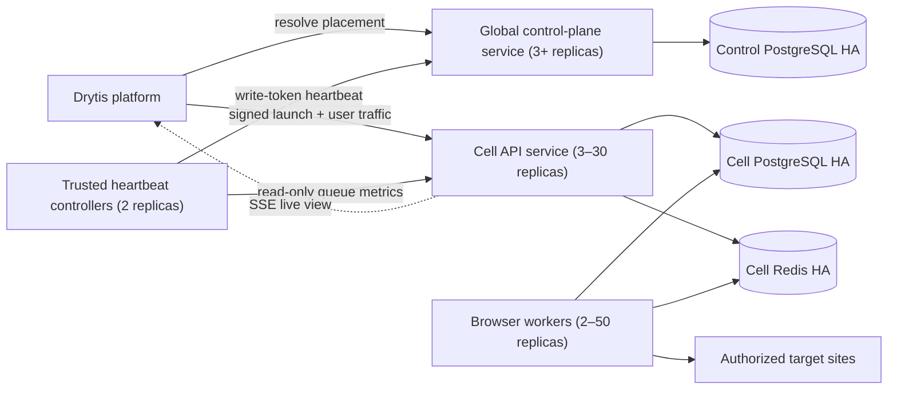

# Phase 7 — deployment and resilience baseline

Phase 7 turns the Phase 6 processes into a repeatable deployment unit and adds
safe evidence-gathering tools. It does not deploy to a real cluster and does not
claim one-million-user capacity. Capacity is earned through measured tests in
each target environment.

## Runtime topology



One immutable image runs four commands: `npm start`, `npm run worker`,
`npm run control-plane`, and `npm run cell-heartbeat`. The worker is the only
role that launches Chromium. The heartbeat controller is the only cell role
that holds the global write token. PostgreSQL and Redis remain managed,
independently recoverable dependencies.

## Heartbeat behavior

The controller registers stable cell metadata on startup, reads only the
bearer-protected cell `/metrics` endpoint, then publishes queue depth and oldest
queued age to the control plane. Calls have bounded timeouts, execution cycles
cannot overlap, and retry delay uses capped exponential backoff with jitter.
Readiness fails closed after three missed intervals. State and logs contain no
tokens or upstream response bodies.

Duplicate controllers are safe: registration is an upsert and heartbeats are
last-observation updates. A controller outage longer than the control-plane
staleness window makes the cell ineligible for new placement resolution; it
does not silently redirect tenants or move persisted run data.

## Deployment sequence

1. Provision one HA control PostgreSQL service, and HA PostgreSQL/Redis per cell.
2. Create distinct runtime and migrator database roles. Runtime roles cannot own
   tables, bypass RLS, create extensions, or run DDL.
3. Generate random independent metrics, control-read and control-write tokens
   in a secrets manager. The Drytis resolver receives read only; heartbeat
   controllers receive write; neither reaches browsers.
4. Build from `Dockerfile`, vulnerability-scan and sign the image, then pin its
   digest in a provider-specific overlay.
5. Run both migration Jobs once and verify their checksums. Back up databases
   immediately before any later schema migration.
6. Deploy control plane, cell API, workers, then heartbeat controllers. Wait for
   readiness at every gate.
7. Create/verify project placement and run a signed Drytis canary. Confirm the
   canary's tenant claims, durable job, worker lease, SSE stream and final report.
8. Run `npm run deployment:smoke`, observe at least one full SLO window, and add
   traffic in small weighted increments with an automatic rollback threshold.

## Safe checks

Smoke checks issue GET requests only and accept only `/healthz` or `/readyz`:

```text
QASE_SMOKE_TARGETS=api=https://qase.example.com/readyz,control=https://control.internal/readyz
npm run deployment:smoke
```

The placement load probe is also read-only and capped at 10,000 requests and
200 concurrent requests. Use a dedicated non-production placement and read
token. Start at the defaults, watch database/connection-pool saturation, and
increase one dimension at a time:

```text
QASE_LOAD_CONTROL_URL=https://control.internal
QASE_LOAD_ORGANIZATION_ID=<test-organization-uuid>
QASE_LOAD_PROJECT_ID=<test-project-uuid>
QASE_CONTROL_API_READ_TOKEN=<read-token-from-secret-manager>
npm run deployment:load
```

Do not run a load probe against production without an approved change window.
It tests placement reads only; browser-worker capacity requires a separately
approved synthetic QA workload against a target owned for load testing.

## Failure drills and expected outcomes

| Drill | Expected behavior | Evidence to retain |
| --- | --- | --- |
| Terminate one API pod | Service stays ready; SSE reconnects with durable sequence | request IDs, reconnect count, no lost events |
| Terminate a busy worker | Lease expires; bounded retry resumes or fails visibly | job/attempt IDs, lease age, terminal state |
| Block Redis briefly | APIs fail admission visibly; active PostgreSQL state remains intact | 5xx/queue metrics, recovery time |
| Fail cell primary DB | Cell readiness fails; no cross-tenant fallback | RTO, failover logs, RLS checks |
| Stop heartbeat controllers | Cell becomes stale and new resolution fails closed | stale timestamp, resolver 404, alert latency |
| Set cell to draining | No new placements/resolution; existing data is not moved | placement audit event, active-run outcome |
| Stop one control replica | Internal service stays ready through remaining replicas | probe history, error rate |
| Restore backup to isolation | Checksums and tenant/RLS canaries pass before promotion | restore duration, RPO delta, signed approval |

Run destructive drills only in a dedicated staging cell first. Never combine a
schema change, dependency failover and application rollout in one experiment.

## Recovery objectives and backup contract

Choose business-approved objectives before launch. A sensible initial target to
validate is control metadata RPO <= 5 minutes/RTO <= 30 minutes and cell run data
RPO <= 5 minutes/RTO <= 60 minutes. These are targets, not guarantees.

- Enable encrypted continuous WAL/archive recovery plus daily full backups for
  both database classes; test point-in-time restore quarterly.
- Redis transports jobs but PostgreSQL is durable authority. Rebuild Redis only
  through the documented lease/recovery path; never infer completed runs from
  Redis alone.
- Store image digests, migration checksums, configuration versions and key IDs
  with every release record. Backups must not contain plaintext ephemeral test
  credentials.
- Restore into an isolated network, run migrations only if the restore version
  requires them, verify row counts/checksums/RLS, then perform signed canaries.
- DNS/load-balancer promotion requires two-person approval and a documented
  return path. Do not drop the old databases during the observation window.

## Rollback

Roll application roles back to the previous signed image digest. Do not roll a
database schema backward unless that exact down-migration was rehearsed; prefer
forward-compatible expand/contract migrations. Keep control metadata and cell
data in place. If control plane is unavailable, pause new Drytis launches rather
than guessing a cell or bypassing tenant placement.

## Phase boundary

This phase supplies portable process/container definitions, Kubernetes baseline
manifests, trusted heartbeat automation and bounded checks. Cloud account setup,
managed database creation, TLS/DNS, secret-manager integration, observability
backend selection, cost policy and real load/failure execution remain deployment
decisions requiring explicit authorization.
