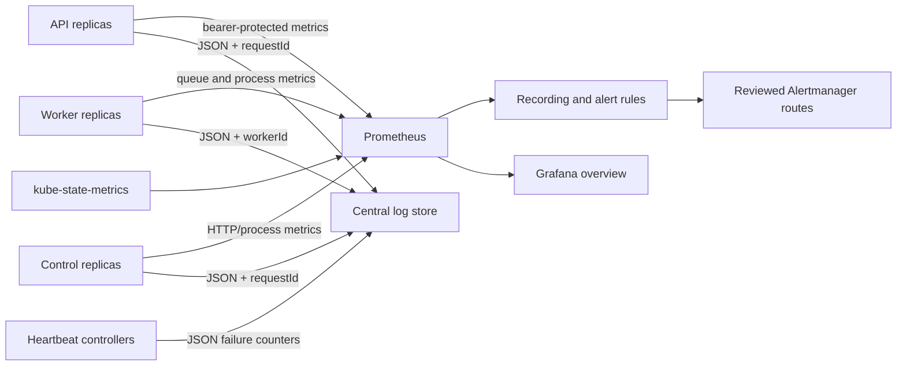

# Phase 8 — enterprise observability and release assurance

Phase 8 makes the Phase 5–7 signals actionable without selecting a hosted
vendor. It adds correlation-safe JSON logs, Prometheus discovery/recording and
alert rules, a Grafana dashboard, and a bounded read-only release gate. Nothing
in this phase deploys infrastructure or sends production traffic.

## Signal flow



Metrics endpoints stay private and require external Secret-backed bearer
credentials. ServiceMonitor relabeling adds only the fixed `qase_role` label.
HTTP route labels are normalized Express templates, never user URLs or run IDs.

## Initial service objectives

Treat these as initial objectives to validate with the business and SRE team,
not as contractual guarantees:

| Indicator | Objective | Window |
| --- | --- | --- |
| API/control HTTP availability | 99.9% non-5xx responses | rolling 28 days |
| API/control HTTP latency | p95 <= 2.5 seconds | rolling 5 minutes for alerting |
| Queue wait | oldest queued job <= 120 seconds | continuous while traffic exists |
| Metrics coverage | every API, worker, and control role discoverable | continuous |
| Deployment health | desired replicas available | within 5 minutes of a rollout |

The availability budget is 0.1%. Fast-burn alerting uses 14.4 times that budget
over 5-minute and 1-hour windows; slow-burn alerting uses 6 times over 30-minute
and 6-hour windows. A 4xx response is a served request, while overload 503s and
unexpected 5xx responses consume the budget. Target-site and model-provider
performance need separate upstream SLOs; do not blame Qase availability for an
authorized target's outage without correlated evidence.

## Structured log contract

Production defaults to newline-delimited JSON. Each record has `timestamp`,
`severity`, `component`, and a stable event name. Allowed correlation metadata
is explicitly bounded. HTTP completion records contain generated `requestId`,
method, normalized route, status and duration—never raw URL, query, body, cookie,
authorization header, credential, run content, or upstream error body.

Set `QASE_LOG_LEVEL=info` and `QASE_LOG_FORMAT=json` in production. Send stdout
to the central collector. Restrict log access and retention as production data,
even though the application rejects unknown metadata fields. Join an HTTP error
to durable events using the request/correlation UUID; do not add user content to
logs to make searching easier.

## Install and validate the overlay

1. Install/review Prometheus Operator, kube-state-metrics, Grafana, the central
   log collector and Alertmanager outside this repository.
2. Ensure Prometheus can select `app.kubernetes.io/part-of=qase` monitors/rules
   and read only the referenced metrics-token Secret keys.
3. Replace the example runbook origin in `prometheus-rules.yaml` with the
   approved internal documentation origin.
4. Apply `deploy/observability/service-monitors.yaml`, then confirm API, worker
   and control targets are up before applying `prometheus-rules.yaml`.
5. Import `grafana-dashboard.json` and bind `DS_PROMETHEUS` to the production
   data source. Never add credentials as dashboard variables.
6. In staging, stop one disposable replica, trigger one overload/queue alert,
   verify notification ownership and recovery, then clear the test evidence.
7. Observe at least one full alert window with no unexplained gaps before a
   production canary.

## Release gate and canary

The automated gate performs only repeated GET requests to reviewed health or
readiness URLs. It accepts at most 10 attempts and fails on any non-2xx result or
when per-target p95 exceeds the configured threshold. Its JSON output contains
the release identifier, target aliases, status codes and latency—no URLs or
credentials.

```text
QASE_RELEASE_ID=sha256:<reviewed-image-digest>
QASE_SMOKE_TARGETS=api=https://qase.example.com/readyz,control=https://control.internal/readyz
QASE_RELEASE_ATTEMPTS=3
QASE_RELEASE_MAX_READY_P95_MS=2000
npm run deployment:release-gate
```

Passing this gate is necessary, not sufficient. A production canary also needs:

1. successful image signature/admission and migration checksum verification;
2. all desired replicas ready and all three metrics roles present;
3. one dedicated Drytis test tenant resolving to the intended cell;
4. one signed launch, harmless QA run, live SSE reconnect, worker completion and
   final report with matching request/job/run correlation IDs;
5. no fast-burn, queue, lease, overload, database or Redis alert during the
   observation window;
6. human approval before raising the traffic weight.

Stop the rollout automatically on a failed gate, critical alert, tenant mismatch,
missing correlation evidence or unknown state. Roll back the image digest; do
not reverse a schema automatically.

## Incident runbooks

### Scrape or role down

Confirm whether the application probe, Service selector, Prometheus discovery or
bearer credential failed. Compare `up` with Kubernetes readiness and structured
`process.started`/`process.draining` events. Do not disable metrics authentication.
If an entire role is absent, halt rollouts and restore its last signed image.

### Availability burn

Split the 5xx rate by `qase_role`, normalized route and status class. Correlate
request IDs with database/Redis/provider telemetry. If a new release aligns with
the burn, stop traffic increase and roll back. If overload is the cause, preserve
the guard and reduce admission or add measured capacity; never remove the limit
during an incident.

### Latency or overload

Check p95 alongside mutation in-flight, rejection count, connection-pool usage,
Redis latency, CPU and memory. Identify the constrained tier before scaling.
Scaling API replicas can exhaust PostgreSQL sooner; scaling workers can exhaust
browser memory or provider quotas. Keep queue admission bounded.

### Queue pressure

Check queued, leased and cancelled states plus oldest age. Verify workers are
ready and claiming leases. Pause new canary/optional traffic first. Scale only
within rehearsed database, Redis, browser, target-site and provider ceilings.
Never delete queued rows as an incident response.

### Expired leases

Correlate worker shutdown/crash events with lease age and attempt count. Confirm
the durable recovery path retries within its cap and ends visibly if exhausted.
Do not manually mark jobs successful. Repeated expirations on one node require
draining that node and preserving its diagnostics.

### Deployment unavailable

Inspect rollout conditions, readiness reason, scheduling, image admission and
dependency reachability. Respect disruption budgets. If desired capacity is not
restored inside five minutes, stop the rollout and return to the previous digest.
Heartbeat readiness failure intentionally makes a cell stale for new resolution.

## Evidence and retention

Every release record should retain the source commit, signed image digest,
migration checksums, sanitized gate output, canary run ID, dashboard snapshot,
alerts fired/silenced, approvers and rollback decision. Store it in the approved
change system, not in this repository. Never attach `.env`, Secret manifests,
cookies, credentials, raw browser storage or user/test content.

## Phase boundary

This phase provides portable telemetry configuration and release evidence. It
does not choose a hosted monitoring vendor, create notification integrations,
set legal retention, provision production infrastructure, execute a load test,
or certify capacity. Those actions require platform-owner approval and measured
staging evidence.
