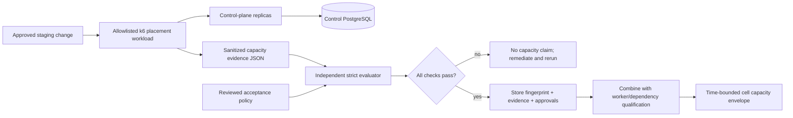

# Phase 9 — capacity qualification and resilience evidence

Phase 9 supplies a safe measurement protocol; it does not certify a production
system from a laptop. The included workload is read-only, staging-only and
limited to global placement resolution. It cannot create users, runs, browser
sessions, placements or credentials. Browser-worker and dependency testing
remain controlled platform exercises because they consume real infrastructure,
provider quota and target-site capacity.

## Qualification flow



The evaluator rejects unknown fields and inconsistent counts, error rates,
throughput or latency ordering. It outputs a SHA-256 evidence fingerprint and
each policy decision. A pass proves only that one reviewed release met one
policy on one recorded staging topology.

## Safety controls

The k6 workload refuses to initialize unless all of these are true:

- `QASE_CAPACITY_ACK` exactly equals `I_OWN_THIS_STAGING_TARGET`;
- the control target is an HTTPS origin without credentials, path or query;
- its hostname appears exactly in `QASE_CAPACITY_ALLOWED_HOSTS`;
- dedicated test organization/project UUIDs differ;
- only a read-scope control token is supplied;
- target/release identifiers are safe aliases, not URLs or free text.

It issues GET placement resolutions only, discards response bodies, uses a
normalized metric name, caps the rate multiplier at 100 and VUs at 1,000, and
aborts when failed-request rate reaches 0.1%. Defaults ramp for 29 minutes from
10 to 200 requests/second and back down. No workload was run while implementing
this phase.

## Qualification matrix

One passing control-plane test is not a cell qualification. Capture every row:

| Tier | Required workload/evidence | Primary limits |
| --- | --- | --- |
| Global control plane | Included placement resolution ramp + 30–60 minute soak | HTTP p95/p99, 5xx, DB CPU/locks/connections |
| Cell API | Signed synthetic Drytis launch/read/SSE mix using dedicated tenants | RPS, SSE connections/reconnects, mutation guard, pool use |
| Browser workers | Harmless runs against an owned synthetic target | concurrent browsers, runs/hour, queue age, RSS/CPU, lease expiry |
| Cell PostgreSQL | Application workload plus reviewed DB telemetry/failover | transactions, locks, IOPS, WAL, pool saturation, RPO/RTO |
| Redis | Durable job transport/reconnect exercise | command latency, memory, reconnects, stream/pubsub loss |
| Model provider | Approved quota/cost window with harmless prompts | requests/tokens per minute, latency, throttling, spend |
| Target site | Written owner authorization and synthetic test endpoints | allowed RPS, rate limits, data cleanup, downstream effects |
| Full cell | API + worker + dependencies together, then one failure at a time | SLOs, recovery, zero data/tenant violations |
| Multi-cell | Drytis placement distribution and one draining/stale cell | correct routing, isolation, no hidden cross-cell state |

API/browser scenarios intentionally are not automated here: they need a signed
Drytis test identity, an explicit model budget and an owned target. Automating
those without the platform owner's test fixtures would turn a safe repository
tool into an uncontrolled traffic/cost generator.

## Execute the control-plane qualification

1. Clone production topology into isolated staging with synthetic placement
   data and separate credentials. Confirm monitoring/alerts and rollback owner.
2. Freeze the image digest, migration checksums, replica counts, pod resources,
   database/Redis tiers, pool sizes and k6 runner location in the change record.
3. Review `load/k6/control-plane-placement.js` and the target allowlist. Start at
   multiplier 0.1 if the environment has no prior baseline.
4. Run from a capacity runner outside the target cluster so the test does not
   compete for its CPU/network. Never run from a developer workstation for a
   qualification result.
5. Stop on any critical alert, tenant mismatch, credential exposure, unknown
   state, database/Redis safety limit, or error threshold. Preserve partial
   evidence and do not raise limits mid-run.
6. Evaluate the output against a policy approved before the run:

   ```text
   npm run capacity:evaluate -- capacity-evidence.json deploy/qualification/capacity-policy.example.json
   ```

7. Repeat the passing plateau at least three times and perform a 30–60 minute
   soak. A single ramp is insufficient for cache, connection, memory or WAL
   stability.
8. Store raw tool output, evaluator report/fingerprint, dashboards and approvals
   outside Git. Never store tokens, URLs containing credentials, browser state,
   `.env` or real user/test content.

The example policy is a starting point, not an approved production target.
Review it against the Phase 8 SLO and business traffic model before use.

## Translating registered users into demand

“One million users” is not a workload. Define at least:

- peak concurrently active fraction;
- QA launches per active user per peak hour;
- API requests and SSE connections per active user;
- average and p95 run duration;
- average browser concurrency and provider tokens per run;
- regional distribution and failure-zone reserve.

Use measured values:

```text
peak_launches_per_second =
  registered_users * peak_active_fraction * launches_per_active_user_per_hour / 3600

peak_concurrent_runs = peak_launches_per_second * measured_p95_run_seconds

required_cells = ceil(max(
  peak_api_requests_per_second / qualified_api_rps_per_cell,
  peak_concurrent_runs / qualified_concurrent_runs_per_cell,
  peak_launches_per_second / qualified_launches_per_second_per_cell
) * headroom_factor)
```

Use a headroom factor approved for loss of a zone/cell, normally greater than
1.25 and often much higher for browser/provider bursts. Apply provider, target,
database and Redis ceilings after the formula; the smallest safe limit wins.
Never substitute registered-user count for concurrent demand.

## Resilience drills

The checked schema accepts only operator-approved evidence with at least one
correlation UUID, zero data loss, zero cross-tenant violations and fail-closed
behavior. It covers API replica loss, worker lease expiry, Redis interruption,
database failover, heartbeat outage, control replica loss and isolated backup
restore.

For each drill:

1. define expected alerts, detection/recovery maximums, abort condition and
   rollback owner before touching staging;
2. run only one failure at a time after a stable baseline;
3. preserve request/run/job correlation IDs and dependency timelines;
4. verify existing work and new admission separately;
5. verify tenant scope and secret handling before declaring recovery;
6. restore the exact baseline and observe a clean SLO window before the next
   drill.

Do not ship automated pod deletion, network blocking or database failover from
this repository. Those commands are provider-specific and destructive; the
platform team must execute reviewed runbooks with its normal approval system.

## Acceptance and expiration

A capacity envelope is valid only for the tested release, topology, quotas,
policy and region. Fail qualification if any evaluator check, Phase 8 SLO,
security invariant, drill objective or cost ceiling fails. Do not average away a
failed replicate.

Requalify after material code/schema changes, database/Redis/provider changes,
resource/pool changes, browser upgrades, traffic-shape changes, new regions, or
90 days—whichever comes first. Production autoscaling maxima must not exceed the
qualified envelope, and the autoscaler must leave failure reserve.

## Phase boundary

Phase 9 provides staging workload source, strict evidence/policy validation,
schemas, safety controls and the qualification method. It does not execute k6,
browser load or failure drills; provision a runner; change provider quotas;
create synthetic Drytis identities; or certify a user count. Those actions need
real platform ownership, budgets and measured staging results.
