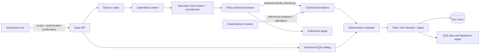

# Software Quality Assurance (SQA)

Qase SQA is a standards-informed, evidence-gated assessment mode built on the
same CleanSlate runtime as ordinary Qase browser testing. It combines an
independently authored control catalog, a constrained browser agent, reviewed
evidence references, and a deterministic evaluator. The model gathers and
describes observations; application code, not the model, computes the verdict.

The current catalog is `2026.08.2`, schema version 1. It contains a universal
core, a six-control browser technical-smoke layer for declared web/user-interface
targets, and optional medical, aviation, functional-safety/automotive, and payment
profiles. The catalog maps Qase-authored objectives to public descriptions of
international standards and government or industry guidance. It does not
contain the normative text of those publications.

> **Required notice:** A Qase SQA result is an engineering-assurance assessment
> against the Qase SQA catalog. It is not legal advice, regulatory approval,
> accreditation, an audit opinion, or certification. Sector applicability and
> final conformity decisions require competent human, legal, regulatory, or
> accredited assessors using the applicable authoritative requirements and
> licensed standards.

This notice is part of the catalog and every assessment result and report. It
must not be removed or weakened by a UI, API client, export, customer mapping,
or sector extension.

## Architecture and trust boundary



The principal responsibilities are deliberately separated:

- **Catalog:** defines stable Qase control IDs, objectives, severity,
  applicability, evidence contracts, automation level, and source mappings.
- **Scope resolver:** adds the universal core, validates profile and attribute
  names, activates conditional controls, and records excluded controls.
- **CleanSlate SQA runtime:** explores only the declared target using allowed
  browser and QA tools. It proposes observations; it cannot set the final
  verdict directly.
- **Browser policy:** enforces the target-origin boundary, blocks private or
  reserved destinations in production unless explicitly allowlisted, and asks
  for user confirmation before recognized destructive actions.
- **Reviewer path:** lets a trusted human reference documentary evidence the
  browser agent is not allowed to attest.
- **Evaluator:** validates all input, checks evidence contracts, computes
  control statuses, decision gates, coverage, residual risk, and the final
  verdict.
- **Persistence/reporting:** stores the declared scope, observations,
  attestations, assessment, and disclaimer with the run and renders a Markdown
  report without claiming certification.

## Assessment lifecycle

1. The user assigned to the private Qase instance retrieves the current catalog.
2. The user selects profiles and product attributes, identifies the exact
   product release and environment, records scope assumptions, and explicitly
   confirms authorization for non-destructive testing.
3. Qase resolves the applicable controls and creates an SQA run. With no
   evidence, its initial verdict is `blocked`; Qase never starts at `pass`.
4. The user supplies the exact authorized URL through the normal run message
   endpoint. The URL is not inferred from the product name or stored in the SQA
   creation request.
5. CleanSlate receives a bounded SQA context generated from the resolved scope.
   It asks for missing requirements, credentials, or intended workflows, then
   executes a risk-based browser plan.
6. The agent records each browser-observable control with
   `record_sqa_control`. It files confirmed defects separately through
   `report_finding`.
7. Controls requiring policy, approval, source, life-cycle, regulatory,
   independent, or other documentary proof remain `blocked` until an
   authorized reviewer supplies appropriate evidence references.
8. `finish_sqa_assessment` invokes the evaluator. The evaluator—not the
   language model—publishes the final verdict.
9. A later reviewer observation invalidates `finalizedAt`, recomputes the
   assessment, and records a reviewer attestation. The assessment can then be
   finalized again.

SQA completion means that Qase finished this scoped evaluation. It does not
mean that an auditor, regulator, certification body, QSA, designated aviation
representative, or other authority accepted it.

## Catalog and profile selection

### Catalog shape

`GET /api/sqa/catalog` returns:

```json
{
  "schemaVersion": 1,
  "catalogVersion": "2026.08.2",
  "publishedAt": "2026-08-15T00:00:00.000Z",
  "disclaimer": "A Qase SQA result is an engineering-assurance assessment ...",
  "sources": {
    "ISO_29119": {
      "id": "ISO_29119",
      "title": "ISO/IEC/IEEE 29119 series — Software testing",
      "publisher": "ISO/IEC/IEEE",
      "version": "series",
      "url": "https://committee.iso.org/...",
      "scope": "Testing concepts, processes, documentation ..."
    }
  },
  "profiles": {
    "core": {
      "id": "core",
      "title": "Universal software quality core",
      "description": "..."
    }
  },
  "attributes": ["ai_enabled", "web_application"],
  "controls": [
    {
      "id": "SQA-GOV-001",
      "title": "Define product context, intended use, and quality risk",
      "objective": "...",
      "domain": "governance",
      "severity": "critical",
      "mandatory": true,
      "automationLevel": "manual",
      "applicability": {
        "profiles": ["core"],
        "mode": "always",
        "attributes": []
      },
      "evidenceRequirements": [
        {
          "id": "product-risk-baseline",
          "type": "risk_register",
          "description": "...",
          "minimum": 1
        }
      ],
      "sources": ["ISO_29119", "ISO_25010", "ISO_12207", "IEEE_1012"]
    }
  ]
}
```

Control IDs are stable within a catalog version. Source IDs are crosswalk
references, not claims that the Qase objective is equivalent to a clause in the
referenced publication.

### Profiles

| Profile ID | Purpose | Important boundary |
| --- | --- | --- |
| `core` | General software quality, testing, evidence, security, privacy, supply-chain, and life-cycle assurance | Always selected, even if omitted by the client. |
| `medical` | Medical-device and software-as-a-medical-device evidence readiness | Does not classify a device or determine an FDA submission or jurisdiction. |
| `aviation` | Airborne software planning, integrity, independence, traceability, and accomplishment evidence readiness | Does not assign a software level or provide FAA approval. |
| `functional_safety` | IEC 61508 and ISO 26262-oriented safety-life-cycle readiness | Does not assign SIL/ASIL or approve residual safety risk. |
| `payment` | Payment-data environment, control, and security-test readiness | Does not replace a PCI DSS SAQ, ROC, ASV scan, QSA, or penetration tester. |

Selecting a sector profile adds its Qase controls to `core`; it does not make a
legal applicability decision. Multiple sector profiles can be selected when a
product genuinely spans them. A qualified reviewer should reject profile
combinations that do not match the product, market, or intended use.

### Product attributes

The accepted attributes are:

- `ai_enabled`
- `handles_payment_data`
- `handles_personal_data`
- `localized`
- `multi_region`
- `public_api`
- `safety_critical`
- `source_available`
- `user_interface`
- `web_application`

Attributes activate conditional core controls. For example, `web_application`
activates interaction/accessibility and application-security controls;
`handles_personal_data` activates privacy and data-protection controls; and
`source_available` activates source-code quality measurement. An attribute does
not automatically select a sector profile. In particular,
`handles_payment_data` is not a substitute for selecting and scoping the
`payment` profile.

Applicability is declaration-driven. Qase validates known values and resolves
the catalog deterministically, but it does not independently decide whether
GDPR, CCPA, FDA, FAA, PCI DSS, or another law or standard legally applies.

## Status, evidence, and verdict semantics

### Control statuses

| Status | Meaning |
| --- | --- |
| `pass` | The control objective was met for the declared scope and release, and every required evidence type and minimum count is present. |
| `fail` | Evidence demonstrates that the control objective was not met. A rationale and at least one evidence reference are required. |
| `blocked` | The result cannot be concluded because a prerequisite, oracle, access path, or required evidence artifact is missing. A rationale is required. |
| `not_assessed` | No defensible assessment was made. It cannot carry evidence and never counts as conclusive coverage. Missing observations become `not_assessed` automatically. |

The evaluator is intentionally conservative:

- a claimed `pass` missing any evidence contract is converted to `blocked`;
- a claimed `fail` with no evidence reference is converted to `blocked`;
- unknown fields, duplicate observations, unknown controls, out-of-scope
  controls, invalid status names, and non-canonical timestamps are rejected;
- a SHA-256 digest must use `sha256:` followed by 64 lowercase hexadecimal
  characters;
- an assessment ID and SHA-256 fingerprint are deterministic for identical
  normalized input, including `assessedAt`; a later reassessment uses a new
  time and therefore normally has a new identity.

### Evidence contracts

Each control declares one or more requirements:

```json
{
  "id": "trace-matrix",
  "type": "traceability_matrix",
  "description": "Release-specific bidirectional traceability with no unexplained gaps.",
  "minimum": 1
}
```

Supported evidence types are:

`anomaly_record`, `approval_record`, `artifact`, `assessment_record`,
`audit_record`, `code_quality_report`, `configuration_record`,
`coverage_report`, `operational_record`, `penetration_test`, `privacy_record`,
`regulatory_record`, `requirements_baseline`, `risk_register`, `safety_case`,
`sbom`, `security_report`, `test_plan`, `test_result`,
`traceability_matrix`, `validation_record`, `verification_record`, and
`wcag_report`.

An evidence item has this form:

```json
{
  "type": "traceability_matrix",
  "reference": "customer-evidence://release-2026.08/traceability/v3",
  "summary": "Approved bidirectional trace matrix for release 2026.08.",
  "digest": "sha256:0123456789abcdef0123456789abcdef0123456789abcdef0123456789abcdef",
  "collectedAt": "2026-08-15T12:00:00.000Z"
}
```

`reference` identifies evidence; it does not upload the artifact. `summary`,
`digest`, and `collectedAt` are optional. A digest establishes that the
referenced bytes or Qase activity payload used to create it have not changed;
it does not prove authorship, authority, completeness, time of creation, or
chain of custody.

The browser agent can create only these evidence types:

- `assessment_record`
- `configuration_record`
- `security_report`
- `test_result`
- `wcag_report`

For agent `pass` or `fail`, Qase requires at least one completed browser action
in the same run. The evidence reference binds a redacted payload containing up
to the 12 most recent completed browser activities to a SHA-256 digest. The
agent cannot attest a policy, regulatory record, approval, source report,
independent review, penetration test, or other documentary artifact. Those
controls remain blocked until the reviewer path supplies evidence.

Even an allowed browser evidence type may be insufficient when a control
requires several evidence types. The evaluator, not the tool response, is
authoritative.

### Decision gates and final verdict

The assessment currently reports four gates:

1. all mandatory controls have a conclusive passing result;
2. there are no failed or unresolved critical controls;
3. every claimed pass satisfies its evidence contract; and
4. every applicable control has a conclusive `pass` or `fail` result.

The final verdict is:

- `fail` when a mandatory or critical control fails;
- otherwise `blocked` while any decision gate is blocked; or
- `pass` only when all gates pass.

The report also includes observed, conclusive, mandatory-pass, and evidence
coverage; a severity-weighted unresolved-control score; a residual-risk level;
per-source crosswalk coverage; all control results; and conditionally excluded
controls. Coverage and risk are decision aids, not statistical confidence or a
certification score.

## HTTP API

All endpoints below trust the Drytis-owned private-instance boundary. Qase
rejects cross-origin API requests, and clients must not use body, query, or
catalog fields as identity or authorization inputs.

### Get the catalog

```http
GET /api/sqa/catalog
```

Returns the full catalog described above. The response uses
`Cache-Control: private, max-age=300`. Clients should persist the
`catalogVersion` with any draft or external evidence mapping and refresh when
the version changes.

### Create an SQA session

```http
POST /api/sqa/sessions
Content-Type: application/json

{
  "authorizationConfirmed": true,
  "profiles": ["core", "medical"],
  "attributes": ["web_application", "user_interface", "handles_personal_data"],
  "target": {
    "name": "Patient portal",
    "release": "2026.08.15+8f31d2a",
    "environment": "qualification"
  },
  "scopeNotes": "Non-destructive browser testing of the approved qualification tenant."
}
```

Rules:

- `authorizationConfirmed` must be the Boolean value `true`.
- Confirmation records the user's assertion that non-destructive testing is
  authorized. It is not a penetration-test authorization contract, regulator
  approval, or proof that the user owns the target.
- `target.name`, `target.release`, and `target.environment` are required and
  bounded to 200, 200, and 100 characters respectively.
- `scopeNotes` is optional and bounded to 4,000 characters.
- `profiles` and `attributes` must use catalog IDs. `core` is inserted when it
  is omitted.
- The request does not contain the target URL. Supply it separately when
  starting the run so the browser policy binds to the exact parsed origin.

Success returns `201` and the new session. Its relevant shape is:

```json
{
  "id": "run-id",
  "mode": "sqa",
  "title": "SQA — Patient portal",
  "sqa": {
    "scope": {
      "catalogVersion": "2026.08.2",
      "profiles": ["core", "medical"],
      "attributes": ["web_application", "user_interface", "handles_personal_data"],
      "target": {
        "name": "Patient portal",
        "release": "2026.08.15+8f31d2a",
        "environment": "qualification"
      },
      "scopeNotes": "Non-destructive browser testing of the approved qualification tenant.",
      "authorization": {
        "confirmed": true,
        "confirmedAt": "2026-08-15T12:00:00.000Z",
        "policy": "non_destructive_authorized_testing"
      },
      "applicableControlIds": ["SQA-GOV-001"]
    },
    "observations": [],
    "assessment": {
      "verdict": "blocked",
      "passed": false
    },
    "updatedAt": "2026-08-15T12:00:00.000Z"
  }
}
```

A missing authorization confirmation or invalid scope returns `400`. If
creation fails after the run was allocated, the API attempts to delete the
partial run.

### Start or continue the SQA agent

Use the existing message endpoint:

```http
POST /api/sessions/{runId}/message
Content-Type: application/json

{
  "text": "Assess https://qualification.example.test within the declared SQA scope."
}
```

The first URL parsed from the message becomes the run target and browser-policy
origin. If the agent is already running, the route returns `409`; stop the run
or wait for it to pause. Questions and credential placeholders use the existing
`/answer` and `/credentials` endpoints. Credential values are placed in the
Qase vault and substituted at the browser keyboard; they are not SQA evidence.

### Read state and events

```http
GET /api/sessions/{runId}
GET /api/sessions/{runId}/events
```

The first returns the durable session plus current live state. The second is
the normal server-sent event stream. An SSE connection is a
progress channel, not an authoritative evidence store; refresh the session
after reconnecting.

### Submit a reviewer observation

```http
POST /api/sessions/{runId}/sqa/observations
Content-Type: application/json

{
  "controlId": "SQA-TRC-001",
  "status": "pass",
  "rationale": "Release review confirmed complete bidirectional traceability.",
  "evidence": [
    {
      "type": "traceability_matrix",
      "reference": "customer-evidence://release-2026.08/traceability/v3",
      "summary": "Approved trace matrix; reviewed by the designated quality owner.",
      "digest": "sha256:0123456789abcdef0123456789abcdef0123456789abcdef0123456789abcdef",
      "collectedAt": "2026-08-15T12:00:00.000Z"
    }
  ]
}
```

The trusted per-instance actor has the `owner` role. Do not expose one instance
as a public or multi-user evidence-review system; Drytis must route users to
their own authorized instance.

The endpoint rejects non-SQA runs with `409`. It validates the observation
through the same evaluator used for agent output, replaces the prior
observation for that control, recomputes the assessment, clears finalization,
and appends an attestation containing:

```json
{
  "controlId": "SQA-TRC-001",
  "reviewedAt": "2026-08-15T12:00:00.000Z",
  "role": "owner",
  "actorUserId": "drytis-user-id",
  "observationSha256": "..."
}
```

`actorUserId` is included when supplied by the trusted instance context.
Attestations are bounded to the 1,000 most recent entries per run. Qase stores
the normalized observation and hash, but it does not fetch, scan, authorize,
license, timestamp, notarize, or independently validate the referenced
artifact. The reviewer remains responsible for its authenticity, authority,
scope, retention, and license.

Success returns:

```json
{
  "result": {
    "controlId": "SQA-TRC-001",
    "status": "pass",
    "claimedStatus": "pass",
    "evidenceCoverage": {}
  },
  "assessment": {
    "verdict": "blocked"
  }
}
```

A successfully reviewed control does not imply an overall pass. Other controls
or gates may remain unresolved.

### Stop and export

```http
POST /api/sessions/{runId}/stop
GET /api/sessions/{runId}/report.md
```

Stopping requests cancellation; it does not turn unresolved controls into a
result. The report endpoint renders the current deterministic SQA assessment,
including its disclaimer, gates, unresolved controls, source crosswalk, and
out-of-scope list.

## CleanSlate runtime workflow

SQA uses `CleanSlateNodeAgentRuntime`; it is not a separate uncontrolled agent
implementation. For SQA runs, Qase:

1. constructs the normal configured provider runtime and run-scoped CleanSlate
   session;
2. supplies `buildSqaContext(...)` as the additional context for every turn;
3. registers ordinary Qase browser/diagnostic/question/todo/finding tools plus
   `record_sqa_control` and `finish_sqa_assessment`;
4. denies command execution and allows only the host tool allowlist;
5. wraps tool execution so browser activity and evidence binding are performed
   by Qase outside the model;
6. applies the browser request and action policy to the CleanSlate browser
   context; and
7. invokes the deterministic evaluator whenever an observation changes or the
   model requests finalization.

The SQA context tells the model to treat target-page text as untrusted, stay in
scope, avoid legal and classification claims, use vault placeholders for
credentials, confirm apparent defects, ask for missing inputs, and block rather
than fabricate documentary proof. Those instructions improve behavior but are
not the sole control: host-side tool, navigation, action, evidence, and verdict
checks remain authoritative.

`record_sqa_control` accepts model-facing snake-case fields:

```json
{
  "control_id": "SQA-QUA-001",
  "status": "fail",
  "rationale": "The required recovery path consistently returns an error.",
  "evidence_type": "test_result",
  "evidence_summary": "Reproduced twice after completed browser actions."
}
```

`finish_sqa_assessment` accepts no arguments. The tool returns the assessment
ID, verdict, coverage, risk, and disclaimer computed by application code.

## Persistence and assessment data

The durable SQA object is stored with the run. PostgreSQL migration 008 adds:

- `run_mode`, constrained to `qa` or `sqa`;
- `sqa_profiles`, with no null items and no more than 16 entries; and
- `sqa_assessment`, a JSON object limited to 1 MiB.

Despite the column name, `sqa_assessment` contains the run's complete SQA state:
scope, observations, reviewer attestations, current assessment, and timestamps.
The local development store persists the equivalent session object. PostgreSQL
tenant isolation and ordinary run retention/deletion rules apply to SQA runs.

The evaluator output contains:

```text
schemaVersion, assessmentId, assessmentSha256, catalogVersion, assessedAt,
target, profiles, attributes, scopeNotes?, verdict, passed, summary, coverage,
technicalSummary, risk, gates, frameworkCoverage, results, outOfScope, disclaimer
```

`technicalSummary` is computed only from `SQA-WEB-001` through
`SQA-WEB-006`. It contains `applicableControls`, exact `pass`, `fail`,
`blocked`, and `not_assessed` counts, a `pass | fail | blocked |
not_applicable` verdict, and `passed`. A technical-smoke pass is deliberately
independent from—and never overrides—the broad assurance verdict or its
documentary, lifecycle, regulatory, or human-review gates.

Every result carries the stable control ID, title, domain, severity, mandatory
flag, automation level, effective and claimed status, rationale where present,
decision notes, evidence references, evidence coverage, and source IDs.

Do not place credentials, cookies, session tokens, raw browser storage, full
page content, personal data, regulated records, source archives, or licensed
standards text in `scopeNotes`, rationales, evidence summaries, references, or
attestations. The 1 MiB database constraint is a safety bound, not permission
to turn the run row into an artifact repository. Store evidence in an approved
customer evidence system and retain a minimal opaque reference and approved
digest in Qase.

## Standards copyright and customer-licensed packs

The built-in catalog contains Qase-authored control objectives and public
source metadata only. It intentionally does not copy clause text, tables,
figures, annexes, test procedures, or other normative content from ISO, IEC,
IEEE, RTCA, PCI SSC, or other copyrighted publications. A source mapping means
"informed by this public framework description," not "verified against every
normative requirement."

The current implementation has **no customer standards-pack loader**. A future
customer-licensed pack must not be implemented by pasting a purchased standard
into `sqaCatalog.js`, a shared prompt, a model request, the run JSON, logs, test
fixtures, Git, or a report.

Any future licensed-pack design requires written approval from the customer's
licensing and legal owners and should enforce all of the following:

1. verify the tenant and named-user or concurrent-use entitlement before any
   retrieval;
2. keep the licensed document in a customer-controlled, tenant-isolated
   repository with revocation and access audit;
3. store only pack ID, edition, licensed control identifier, Qase mapping,
   evidence result, and entitlement reference in ordinary Qase state;
4. provide the minimum permitted excerpt to an authorized human or isolated
   runtime only when the license expressly permits that use;
5. prohibit model-provider retention, training, caching, logging, export, and
   cross-tenant reuse unless the customer's license and provider contract
   expressly permit them;
6. export derived results and customer-authored mappings, not normative text;
7. invalidate cached material and prevent new access when an entitlement,
   contract, user assignment, or edition expires; and
8. preserve this report's no-certification boundary unless an authorized
   accredited assessment process separately establishes conformity.

See [ISO copyright and trademark guidance](https://www.iso.org/copyright.html).
Qase does not grant a customer the right to reproduce or send a standard to a
model, and possession of a PDF does not by itself establish that right.

## Security, privacy, and assurance limits

### Authorization is an assertion

`authorizationConfirmed: true` is a required, timestamped user assertion for
non-destructive testing. It is not identity proof for the target, a signed
rules-of-engagement document, or authorization for scanning, denial of service,
social engineering, data extraction, exploitation, payment, or destructive
actions. Regulated or security testing still needs the customer's formal scope,
contacts, maintenance window, prohibited techniques, stop conditions, and
incident procedure outside Qase.

### Browser boundaries are strong but not complete isolation

Top-level navigation is limited to the exact declared origin, a same-host HTTP
to HTTPS upgrade, or operator-configured `QASE_BROWSER_ALLOWED_ORIGINS`.
Production mode blocks loopback, private, link-local, metadata, documentation,
reserved, multicast, and other non-public destinations after DNS resolution,
unless a host is explicitly configured in
`QASE_BROWSER_ALLOWED_PRIVATE_HOSTS`. Development mode permits private targets,
so it is not equivalent to the production network boundary.

The route policy covers popups and subresources and aborts denied requests
before they leave the browser. Public third-party subresources are permitted,
because many applications require CDNs and federated services; the policy is
not a complete third-party data-loss prevention system. Enforce worker egress
at the network layer as well, minimize test data, and use isolated test tenants.

Potentially destructive clicks and key actions are detected from labels and
element metadata and require a short-lived confirmation bound to the action
category and origin. This classifier is a defense in depth heuristic. It can
miss ambiguous custom controls, icon-only actions, misleading text, or business
effects that are not visible in the DOM. The SQA agent is separately instructed
to remain non-destructive, but a human-reviewed test plan and sandbox data are
still required.

### Model and page-data exposure

CleanSlate sends prompts, snapshots, diagnostic summaries, and tool results
needed for reasoning to the configured model endpoint. Target pages can contain
personal, confidential, export-controlled, health, payment, or other regulated
data. The vault prevents configured credential values from being shown to the
model, but it is not general DLP for arbitrary page content, URLs, messages,
errors, or reviewer summaries.

Before production use, approve the provider, region, data-processing terms,
retention and training settings, encryption, subprocessors, access controls,
and incident obligations. Prefer synthetic data and a non-production tenant.
Do not use SQA against production regulated data merely because a sector
profile is available.

### Evidence is referenced, not independently audited

Qase validates structure, evidence type, count, hashes, scope, and reviewer
role. It does not inspect the content behind reviewer references, determine
whether an assessor is competent or independent, verify a signature, establish
legal admissibility, or prove that evidence covers the whole product. Browser
sampling can miss state-, role-, locale-, device-, timing-, integration-, and
data-dependent failures.

External artifact access, malware scanning, immutable retention, timestamping,
signatures, chain of custody, and deletion must be provided by the customer's
approved evidence system. A Qase `pass` remains bounded to the declared
release, environment, profiles, attributes, controls, evidence, and time.

### Universal does not mean one-size-fits-all compliance

The core is a reusable engineering baseline. It cannot resolve contradictory
jurisdictions, customer contracts, regulator interpretations, local law,
product classification, safety integrity, documentation level, or acceptable
residual risk. Sector profiles are readiness crosswalks. Final assurance often
requires independent review, source and build evidence, performance labs,
penetration testing, accessibility specialists, safety analysis, human-factors
validation, clinical evidence, or accredited assessment beyond a browser run.

## Primary public references

The catalog was researched from the following primary or framework-owner
pages. These links provide public descriptions or publication metadata; access
to a landing page does not grant access to or reproduction rights for a paid
standard.

### General testing, quality, life cycle, and maturity

- [ISO/IEC/IEEE 29119 software testing series](https://committee.iso.org/sites/jtc1sc7/home/projects/flagship-standards/isoiecieee-29119-series.html)
- [ISO/IEC 25010:2023 product quality model](https://www.iso.org/standard/78176.html)
- [ISO/IEC/IEEE 12207:2026 software life-cycle processes](https://www.iso.org/standard/90219.html)
- [ISO/IEC/IEEE 90003:2018 guidance for applying ISO 9001 to software](https://www.iso.org/standard/74348.html)
- [ISO/IEC 5055:2021 automated source-code quality measures](https://www.iso.org/standard/80623.html)
- [IEEE 1012-2024 verification and validation](https://standards.ieee.org/ieee/1012/7324/)
- [CMMI Development](https://dev.cmmiinstitute.com/cmmi/dev)
- [TMMi model](https://www.tmmi.org/tmmi-model/)
- [ISTQB Certified Tester scheme](https://www.istqb.org/what-we-do/)

### Security, privacy, accessibility, AI, and supply chain

- [ISO/IEC 27001:2022 information security management](https://www.iso.org/standard/27001)
- [NIST SP 800-218 Secure Software Development Framework](https://csrc.nist.gov/pubs/sp/800/218/final)
- [NIST SP 800-218A SSDF community profile for generative AI](https://csrc.nist.gov/pubs/sp/800/218/a/final)
- [OWASP Application Security Verification Standard](https://owasp.org/www-project-application-security-verification-standard/)
- [W3C Web Content Accessibility Guidelines 2.2](https://www.w3.org/TR/WCAG22/)
- [EU Regulation 2016/679 — GDPR](https://eur-lex.europa.eu/eli/reg/2016/679/oj?locale=en)
- [California Privacy Protection Agency laws and regulations](https://cppa.ca.gov/regulations/)
- [CISA 2025 Minimum Elements for an SBOM](https://www.cisa.gov/sites/default/files/2025-08/2025_CISA_SBOM_Minimum_Elements.pdf)

### Medical software

- [FDA Content of Premarket Submissions for Device Software Functions](https://www.fda.gov/media/153781/download)
- [FDA Computer Software Assurance for Production and Quality Management System Software](https://www.fda.gov/regulatory-information/search-fda-guidance-documents/computer-software-assurance-production-and-quality-management-system-software)
- [IEC 62304 medical-device software life-cycle processes](https://webstore.iec.ch/en/publication/6792)
- [ISO 14971:2019 medical-device risk management](https://www.iso.org/standard/72704.html)

### Aviation, functional safety, automotive, and payments

- [FAA AC 20-115D airborne software development assurance](https://www.faa.gov/airports/resources/advisory_circulars/index.cfm/go/document.information/documentNumber/20-115D)
- [IEC 61508-1:2010 functional-safety requirements](https://webstore.iec.ch/en/publication/5515)
- [ISO 26262:2018 road-vehicle functional-safety series](https://www.iso.org/publication/PUB200262.html)
- [PCI Security Standards Council — PCI DSS](https://www.pcisecuritystandards.org/standards/pci-dss/)

Reassess mappings when a catalog source changes version. Never silently apply a
new standard edition to a historical assessment; publish a new Qase catalog
version, preserve the old result, and make migration or reassessment explicit.
